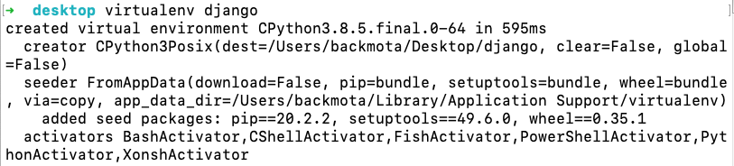
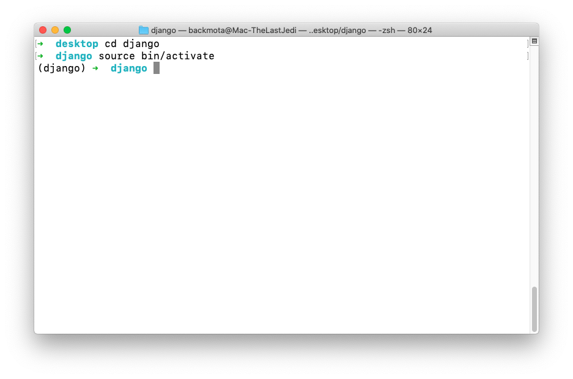
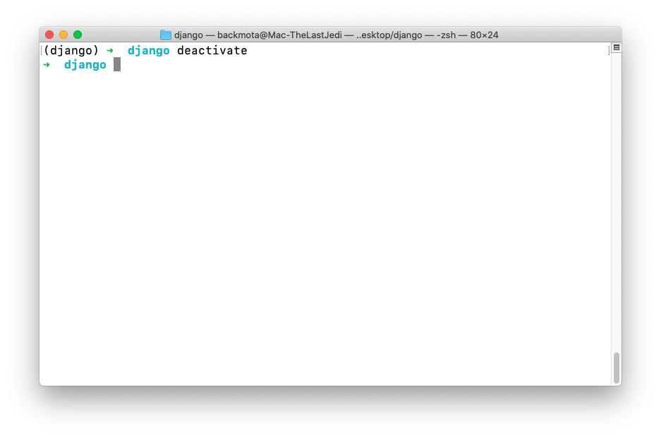
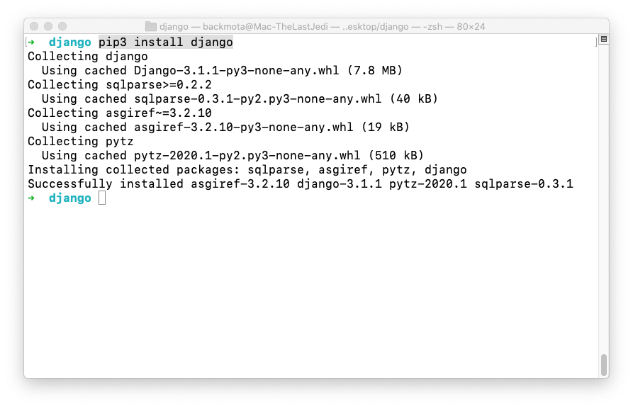
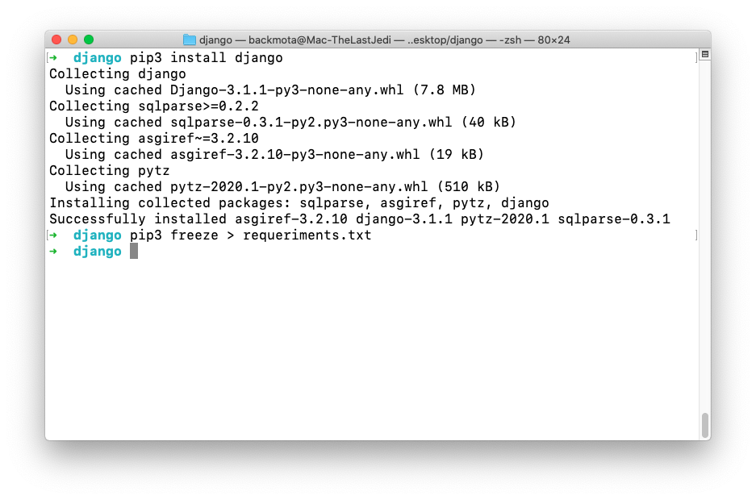
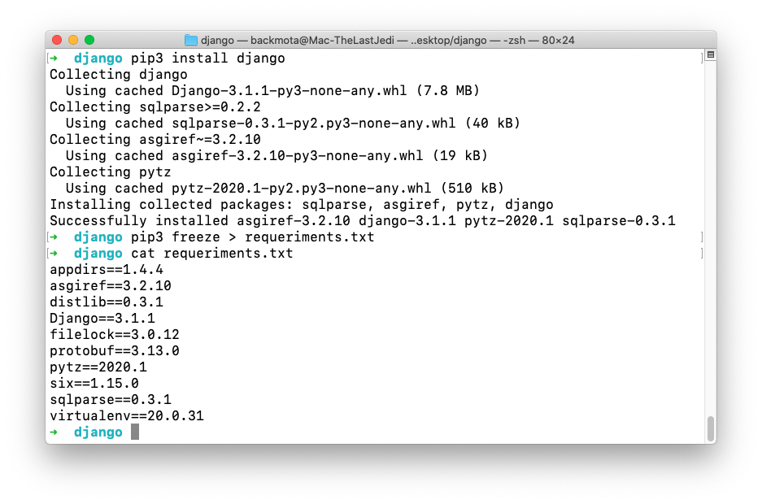
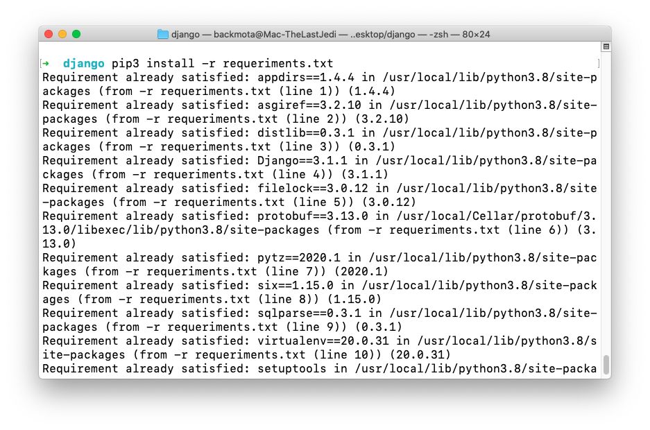
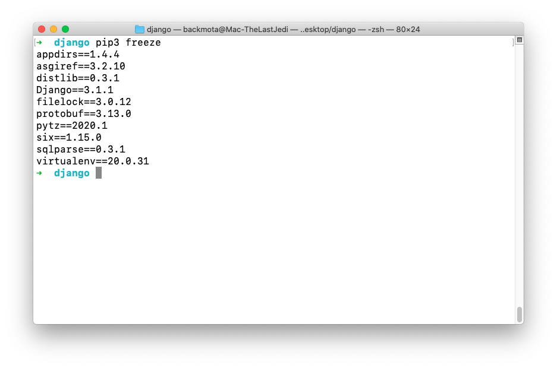

`Fullstack con Python` > [`Backend con Python`](../../Readme.md) > [`Sesión 01`](../Readme.md) > Ejemplo-01
## Entornos virtuales e instalación de Django

### OBJETIVO
- Conocer los entornos virtuales y su aplicación
- Conocer el framework Django y su instalación
- Conocer como distribuir entornos virtuales al equipo de desarrollo

#### REQUISITOS
1. Descargar el repositorio
1. Usar la carpeta de trabajo `Sesion-01/Ejemplo-01`

#### DESARROLLO
1. Crear un entorno virtual para el proyecto base con Django usando el siguiente comando:


   ```console
   virtualenv django
   ```
   
   


   __Nota:__ Revisar concepto de **entorno virtual**

   __Ingresamos al directorio creado:__

   ```console
   cd django
   ```
    __Activaremos el entorno virtual:__

   ```console
   source bin/activate
   ```
   
   
  
   __Para desactivar el nuevo entorno se realiza con:__

   ```console
   deactivate  
   ```
     

   __Activaremos nuevamente el entorno para continuar:__

   ```console
   source bin/activate
   ```
   ***

1. Se procede con la instalación del módulo / framework Django:

   __La instalación se realiza con el comando pip dentro del entorno virtual:__

   ```console
   pip3 install django
   ```
   

   __La página principal del framework Django:__
   - Sitio principal [https://www.djangoproject.com](https://docs.djangoproject.com/en/3.1/)
   - Documentación oficial: [https://docs.djangoproject.com/en/3.1/](https://docs.djangoproject.com/en/3.1/)
   ***

1. Respaldando y restaurando un entorno virtual

   __Para respaldar un entorno virtual se realiza con:__

   ```console
   pip freeze > requeriments.txt
   ```
   
   
   
   __Visualizamos el archivo generado con:__

   ```console
   cat requeriments.txt
   ```
   
   
   
   
   __Para restaurar un entorno virtual se realiza con:__

   ```console
   pip3 install -r requeriments.txt
   ```
	
   

   __Mostramos la lista de módulos instalados:__

   ```console
   pip3 freeze
   ```
   
   

   Ahora estamos listos para continuar con Django.
   ***
