[`Backend con Python`](../../Readme.md) > [`Sesión 01`](../Readme.md) > Ejemplo-02
## Iniciar la construcción de una aplicación web con Django

### OBJETIVOS
- Conocer como iniciar un proyecto en Django
- Conocer como crear una aplicación
- Conocer y definir una ruta en Django
- Conocer y definir una vista asociada a la ruta

#### REQUISITOS
1. Actualizar repositorio
1. Usar la carpeta de trabajo `Sesion-01/Ejemplo-02`
1. Activar el entorno virtual __django__

#### DESARROLLO
1. Crear el proyecto __Banco__ con Django y cambiándonos a la carpeta del proyecto:

   ```console
   django-admin startproject Banco
   ```

1. Ingresamos al directorio creado y lo visualizamos

	```
	   cd Banco
	   ls
   ```
   
   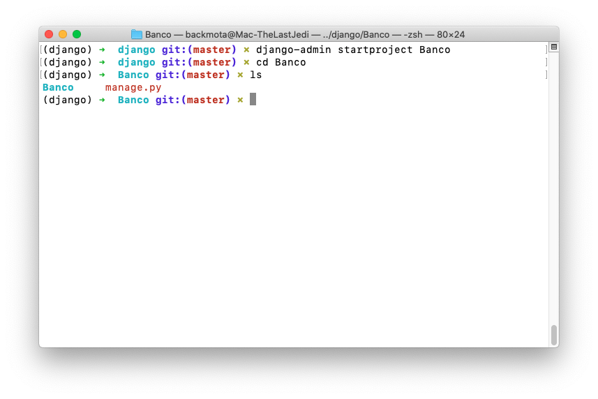

1. Crear la aplicación __tarjeta__ con el comando:

   ```console
   python3 manage.py startapp tarjeta
   ls
   ```
   
   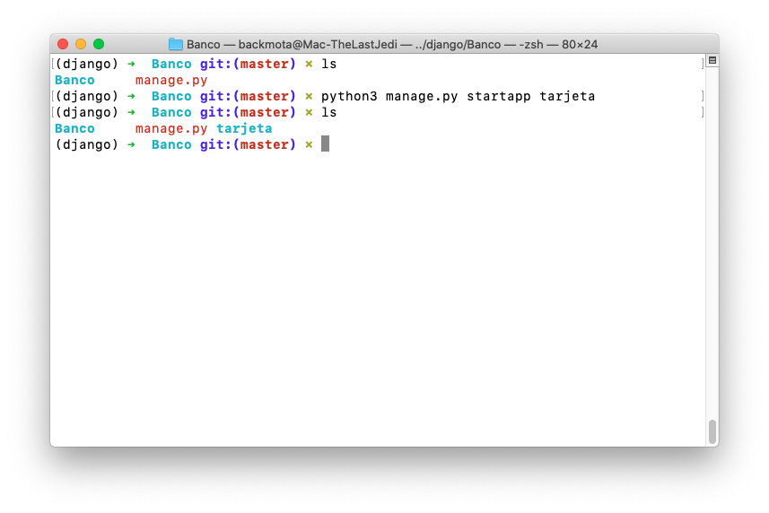
   
   ***

1. Ejecutar el proyecto __Banco__ con:

   ```console
   python3 manage.py runserver
   ```
   
   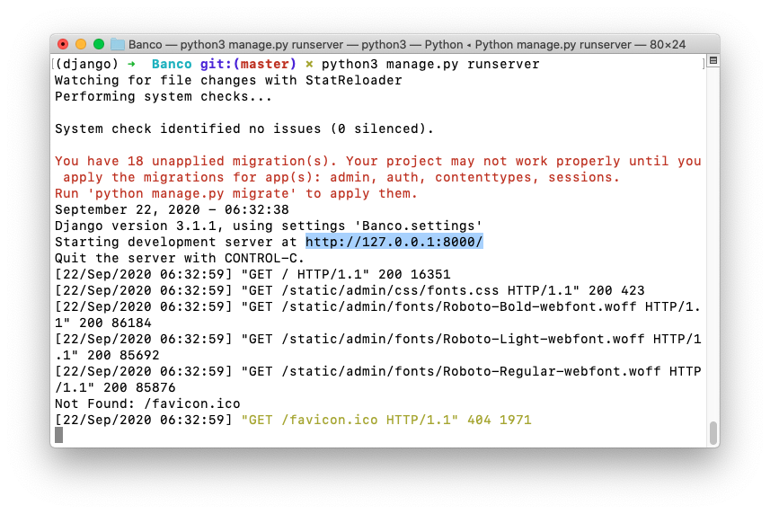
   
   Si se abre la url indicada, se observará lo mismo que el "hola mundo!", así que sigamos un poco más adelante, nuestro objetivo es mostrar la página `index.html` pero como parte de la aplicación web.
   
   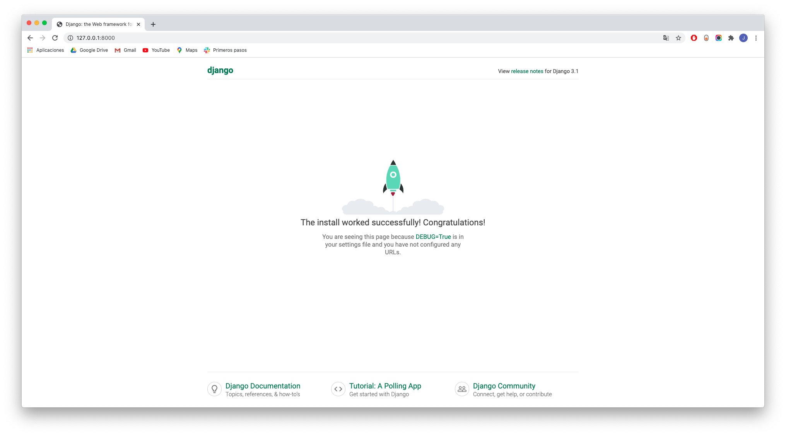

   __Nota:__ Como el servidor bloquea la terminal, vamos a dejar esta terminal aquí y para los siguiente comandos abrir otra terminal, activar el entorno virtual django.
   
   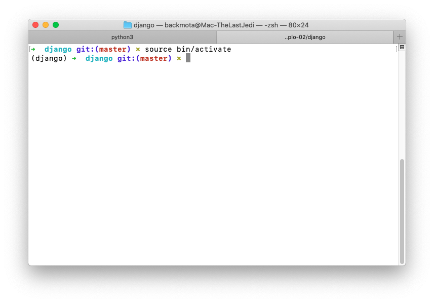

1. Agrega la aplicación __tarjeta__ a la configuración en el archivo `Banco/Banco/settings.py`:

   ```python
   # Application definition

   INSTALLED_APPS = [
       'django.contrib.admin',
       'django.contrib.auth',
       'django.contrib.contenttypes',
       'django.contrib.sessions',
       'django.contrib.messages',
       'django.contrib.staticfiles',
       'tarjeta',
   ]   
   ```
   
   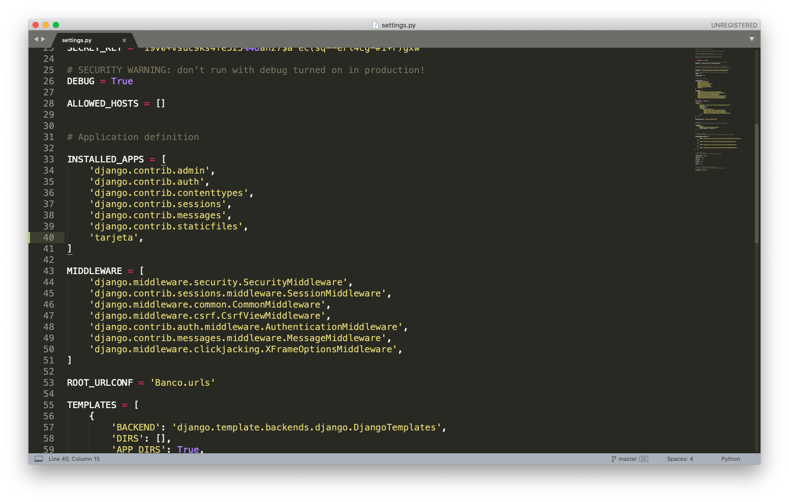

   __Revisar el flujo de una petición HTTP para el caso de Django:__

   [Ver diapos]

1. Agrega información regional a la configuración en el archivo `Banco/Banco/settings.py`:

   ```python
   # Internationalization
   # https://docs.djangoproject.com/en/2.2/topics/i18n/

   LANGUAGE_CODE = 'es-MX'

   TIME_ZONE = 'America/Mexico_City'
   ```
   
   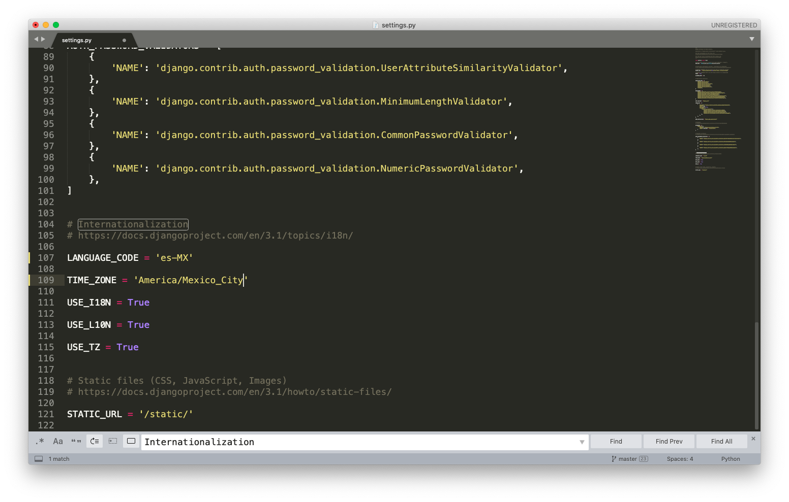
   
   Esto permite que el administrador de django esté en español, además de que el tratamiento de horas y fechas serán referidas a la zona horaria de México.

1. Mapear la url `/` con las rutas generales del proyecto __Banco__ hacia las rutas de la aplicación __tarjeta__

   ```
   url / -> Banco/Banco/urls.py -> Banco/Banco/tarjeta/urls.py
   ```

   __En el archivo `Banco/Banco/urls.py` agregar lo siguiente:__

   ```python
   from django.contrib import admin
   from django.urls import path, include  # modificada

   urlpatterns = [
       path('', include("tours.urls")),  # agregada
       path('admin/', admin.site.urls),
   ]
   ```
   
   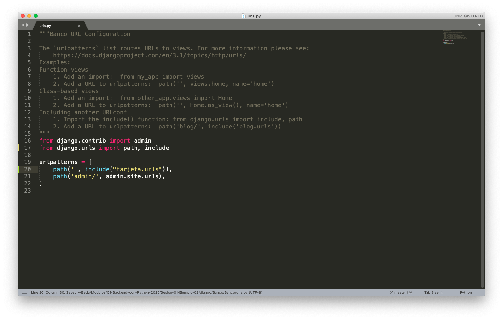

   En la vetana donde se está ejecutando el proyecto __Banco__ se puede observar el siguiente mensaje de error:
   
   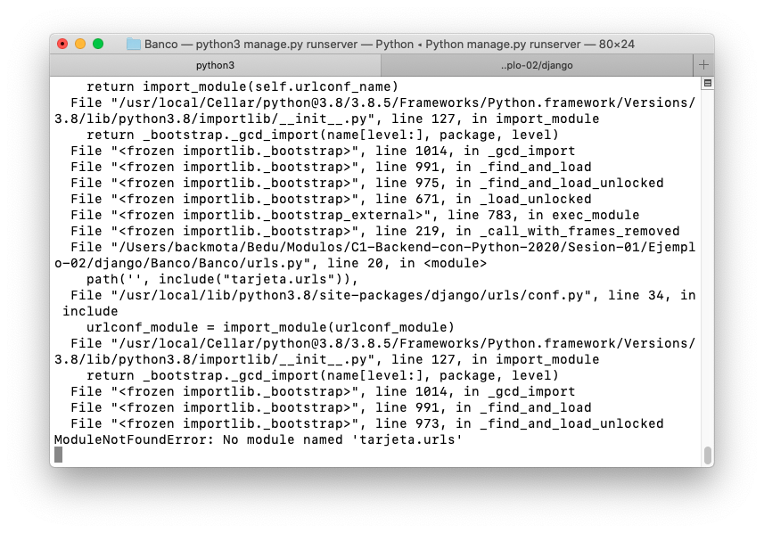

   Lo que indica que nos falta crear el archivo `urls.py` dentro de la carpeta `Banco/tarjeta/`

1. Mapear la url `/` con las rutas de la aplicación __tarjeta__

   ```
   url / -> Banco/tarjeta/urls.py -> Banco/tarjeta/views.py
   ```

   __Crear el archivo `Banco/tarjeta/urls.py` con el siguiente contenido:__
   
   ```
    from django.urls import path
	 from . import views

	 urlpatterns = [
    path('', views.index, name="index"),
	 ]
   ```
   
   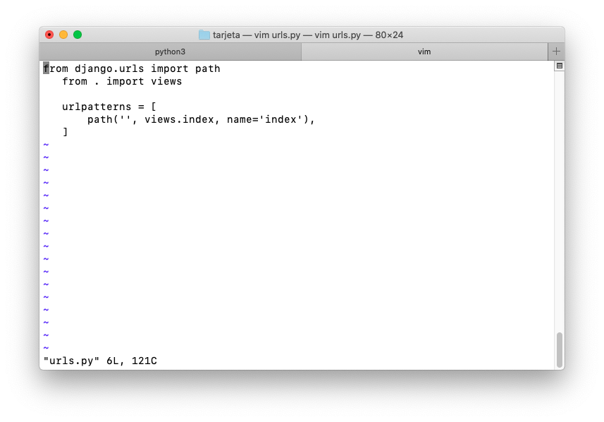

   __Reiniciar Django para observar el resultado:__

   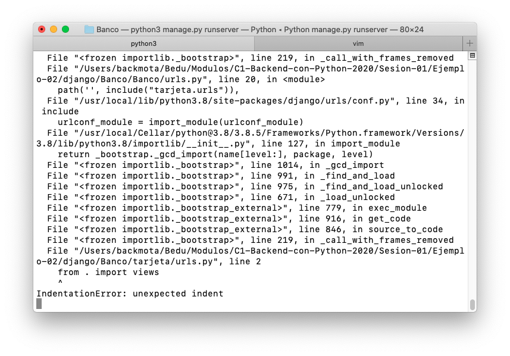
   
   Lo que indica que en el archivo `tarjeta/views.py` no existe una función llamada `index`, así que toca agregar dicha función.

1. Agregar la función/vista `index` al archivo `tarjeta/views.py` con el siguiente contenido:

   ```python
   from django.http import HttpResponse
   from django.shortcuts import render

   # Create your views here.
   def index(request):
       """ Vista para atender la petición de la url / """
       return HttpResponse("<h2>Soy la página de inicio! Hola Mundo!!</h2>")
   ```
    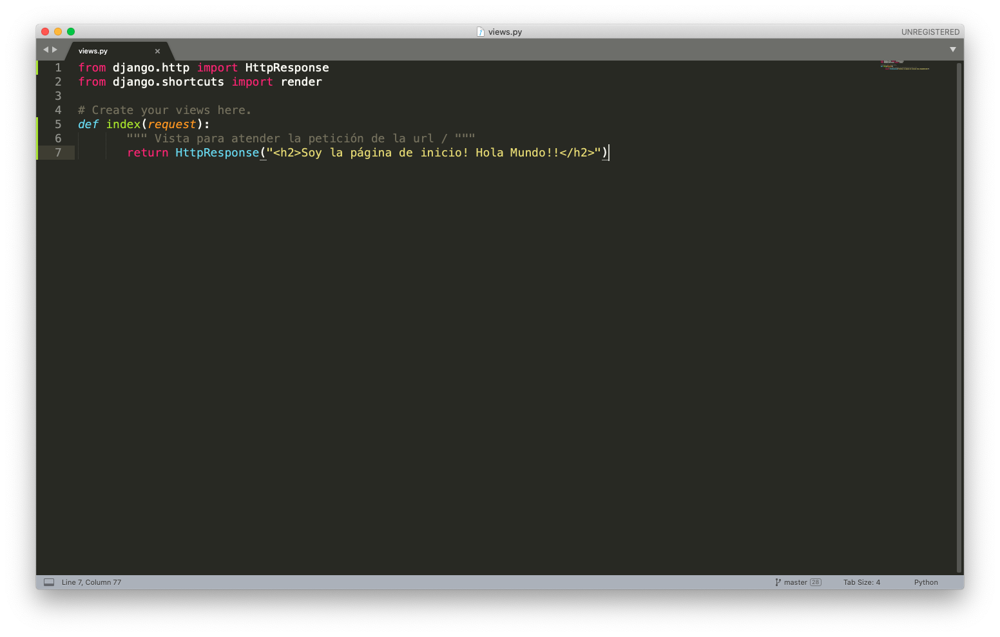

   __Nota: Si la aplicación Django no está iniciada, iniciarla en este momento y abrir la siguiente url en el navegador__

   http://127.0.0.1:8000

   __El resultado debería ser el siguiente:__

   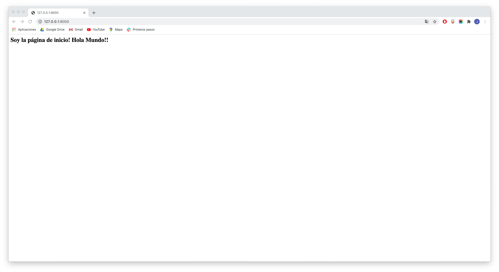
   
   ***
