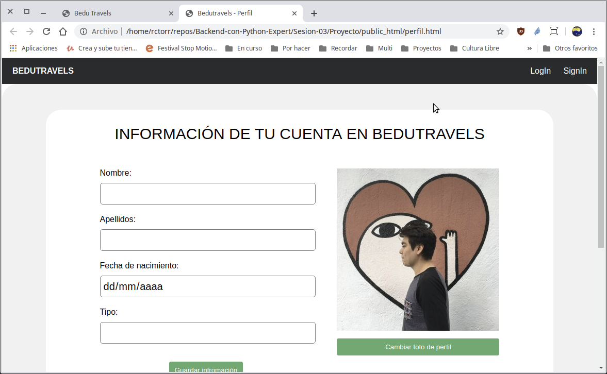
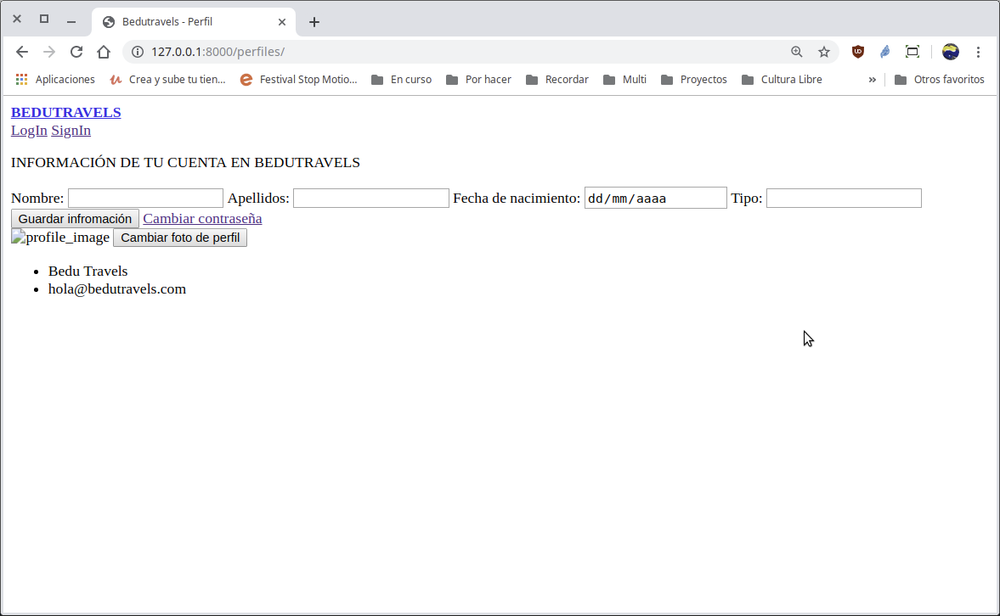

[`Backend con Python`](../../Readme.md) > [`Sesión 03`](../Readme.md) > Proyecto
## Agregar la página de perfil de usuario a la aplicación web Bedutravels

### OBJETIVOS
- Agregar páginas ya maquetadas por medio de las plantillas con Django.
- Configurar y agregar los archivos estáticos en una aplicación web con Django.
- Contar con la página de perfil de usuario del proyecto Bedutravels disponible con Django.

#### REQUISITOS
1. Actualizar repositorio
1. Usar la carpeta de trabajo `Sesion-03/Proyecto/Bedutravels/`
1. Activar el entorno virtual __Bedutravels__
1. Página de perfil de usuario maquetada del proyecto __Bedutravels__

   

#### DESARROLLO
1. Ejecutar el proyecto __Bedutravels__ con:

   ```console
   (Bedutravels) Proyecto/Bedutravels $ python manage.py runserver
   [...]
   June 19, 2019 - 10:38:22
   Django version 2.2.2, using settings 'Bedutravels.settings'
   Starting development server at http://127.0.0.1:8000/
   Quit the server with CONTROL-C.   
   ```
   ***

1. Haciendo uso de las plantillas de Django integrar la página de perfil de usuario que se encuentra en `public_html/perfil.html`.

   __Crear las carpetas `Bedutravels/perfiles/templates/perfiles`:__

   ```console
   (Bedutravels) Proyecto/Bedutravels $ mkdir perfiles/templates
   (Bedutravels) Proyecto/Bedutravels $ mkdir perfiles/templates/perfiles
   ```

   __Copiar el archivo `public_html/perfil.html` dentro de la carpeta `Bedutravels/perfiles/templates/perfiles/`:__

   ```console
   (Bedutravels) Proyecto/Bedutravels $ cp ../public_html/perfil.html perfiles/templates/perfiles/

   (Bedutravels) Proyecto/Bedutravels $ tree perfiles/templates/
   .
   └── perfiles
       └── perfil.html
   ```

   __Crear la función `perfil()` en el archivo `perfiles/views.py` para hacer uso de las plantillas (templates)__

   ```python
   from django.shortcuts import render

   # Create your views here.
   def perfil(request):
       """ Vista para atender la petición de la url /perfil """
       return render(request, "perfiles/perfil.html")
   ```
   Por omisión, Django busca los archivos html en la carpeta `proyecto/aplicacion/templates/aplicacion/`

   __El resultado en el navegador debería de ser el siguiente:__

   

   Hasta aquí ya podemos ver el html, pero ¿y los estilos y las imágenes?
   ***

1. Agregando acceso a los archivos estáticos (ruta y vista)

   __Crear la carpeta `Bedutravels/perfiles/static/perfiles/`:__

   ```console
   (Bedutravels) Proyecto/Bedutravels $ mkdir perfiles/static
   (Bedutravels) Proyecto/Bedutravels $ mkdir perfiles/static/perfiles
   ```

   __Copiar las carpetas de los archivos estáticos (css y img):__

   ```console
   (Bedutravels) Proyecto/Bedutravels $ cp -a ../public_html/css perfiles/static/perfiles/

   (Bedutravels) Proyecto/Bedutravels $ cp -a ../public_html/img perfiles/static/perfiles/

   Sesion-03/Proyecto/Bedutravels $ tree -d 1 perfiles/static/perfiles/
   perfiles/static/perfiles/
   ├── css
   └── img
   ```

   __Finalmente hay que modificar la ruta en el archivo `perfile.html` para que usen el sistema de Django__

   Todas las url relativas o absolutas ahora tienen que ser absolutas e iniciar con `/static/perfiles/`, un ejemplos se muestra a continuación:

   ```html
   <!-- Animate.css -->
   <link rel="stylesheet" href="/static/perfiles/css/index.css">
   <!-- Icomoon Icon Fonts-->
   <link rel="stylesheet" href="/static/perfiles/css/perfil.css">
   ```
   Remplazar todas las coincidencias.

   __Actualizar el navegador y entonces se debería de ver la página mostrada al inicio__

   Si no funciona:
   - Recargar la página forzado actualizar el cache del navegador con `Control+Shift+R`.
   - En la ventana donde se está ejecutando el proyecto, detenerlo y volver a iniciarlo.
   - Usar una ventana de incógnito.
   - Pedir ayuda a un experto (que no vas a encontrar en clase!)

   Si si funciona entonces:
   - Misión cumplida! Ya eres Django Baby!
