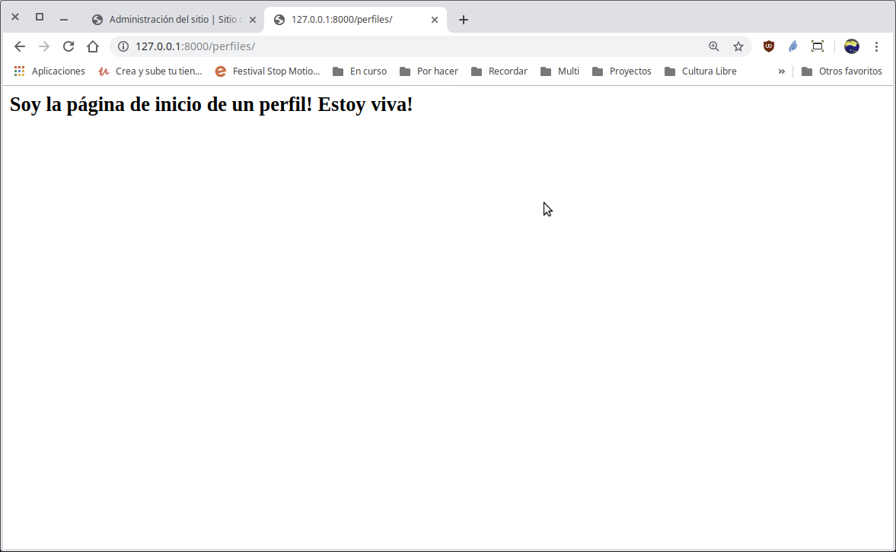

[`Backend con Python`](../../Readme.md) > [`Sesión 03`](../Readme.md) > Reto-02
## Iniciar la construcción de una aplicación web con Django

### OBJETIVOS
- Crear una aplicación en Django
- Definir una ruta en Django
- Definir una vista asociada a la ruta

#### REQUISITOS
1. Actualizar repositorio
1. Usar la carpeta de trabajo `Sesion-03/Reto-02`
1. Activar el entorno virtual __Bedutravels__

#### DESARROLLO
1. Crear la aplicación __perfiles__ con:

   ```console
   (Bedutravels) Reto-02/Bedutravels $ python manage.py startapp perfiles

   (Bedutravels) Reto-02/Bedutravels $ tree
   .
   ├── Bedutravels
   │   ├── __init__.py
   │   ├── __pycache__
   │   │   ├── __init__.cpython-37.pyc
   │   │   └── settings.cpython-37.pyc
   │   ├── settings.py
   │   ├── urls.py
   │   └── wsgi.py
   ├── db.sqlite3
   ├── manage.py
   ├── perfiles
   │   ├── admin.py
   │   ├── apps.py
   │   ├── __init__.py
   │   ├── migrations
   │   │   └── __init__.py
   │   ├── models.py
   │   ├── tests.py
   │   └── views.py
   ├── requeriments.txt
   └── tours
       ├── admin.py
       ├── apps.py
       ├── __init__.py
       ├── migrations
       │   └── __init__.py
       ├── models.py
       ├── __pycache__
       │   ├── admin.cpython-37.pyc
       │   ├── __init__.cpython-37.pyc
       │   └── models.cpython-37.pyc
       ├── tests.py
       ├── urls.py
       └── views.py
   ```
   ***

1. Ejecutar el proyecto __Bedutravels__ con:

   ```console
   Reto-02/Bedutravels $ python manage.py runserver
   [...]

   June 19, 2019 - 10:38:22
   Django version 2.2.2, using settings 'Bedutravels.settings'
   Starting development server at http://127.0.0.1:8000/
   Quit the server with CONTROL-C.   
   ```
   ***

1. Agrega la aplicación __perfiles__ a la configuración en el archivo `Bedutravels/Bedutravels/settings.py`:

   ```python
   # Application definition

   INSTALLED_APPS = [
       'django.contrib.admin',
       'django.contrib.auth',
       'django.contrib.contenttypes',
       'django.contrib.sessions',
       'django.contrib.messages',
       'django.contrib.staticfiles',
       'tours',
       'perfiles',
   ]   
   ```
   ***

1. Mapear la url `/perfiles` con las rutas generales del proyecto __Bedutravels__ hacia las rutas de la aplicación __perfiles__

   ```
   url / -> Bedutravels/Bedutravels/urls.py -> Bedutravels/perfiles/urls.py
   ```

   __En el archivo `Bedutravels/Bedutravels/urls.py` agregar lo siguiente:__

   ```python
   urlpatterns = [
       path('admin/', admin.site.urls),
       path('', include("tours.urls")),
       path('perfiles/', include("perfiles.urls")),  # agregada
   ]
   ```
   ***

1. Mapear la url `/perfiles` con las rutas de la aplicación __perfiles__

   ```
   url /perfiles -> Bedutravels/perfiles/urls.py -> Bedutravels/perfiles/views.py
   ```

   __Crear el archivo `Bedutravels/perfiles/urls.py` con el siguiente contenido:__

   ```python
   from django.urls import path
   from . import views

   urlpatterns = [
       path('', views.index, name='perfiles_index'),
   ]
   ```
   Acuérdate de estar reiniciando Django para observar los resultados y mensajes de error.
   ***

1. Agregar la función/vista `index` al archivo `Bedutravels/perfiles/views.py` con el siguiente contenido:

   ```python
   from django.http import HttpResponse
   from django.shortcuts import render

   # Create your views here.
   def index(request):
       """ Vista para atender la petición de la url /perfiles """

       return HttpResponse("<h2>Soy la página de inicio de un perfil! Estoy viva!</h2>")
   ```

   __Abrir la siguiente url en el navegador__

   http://127.0.0.1:8000/perfiles

   __El resultado debería ser el siguiente:__

   
   ***
