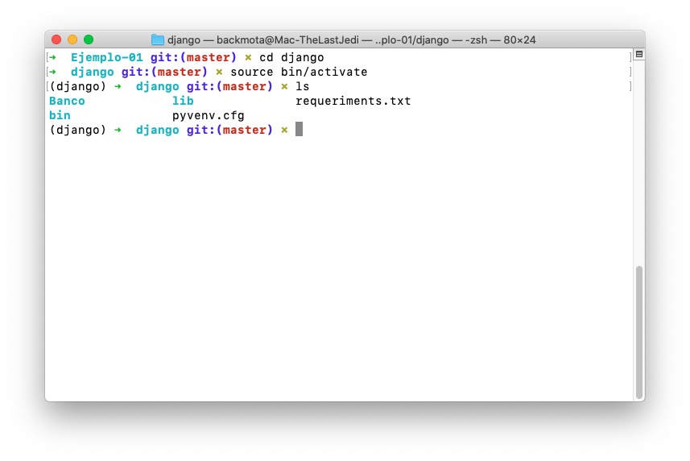
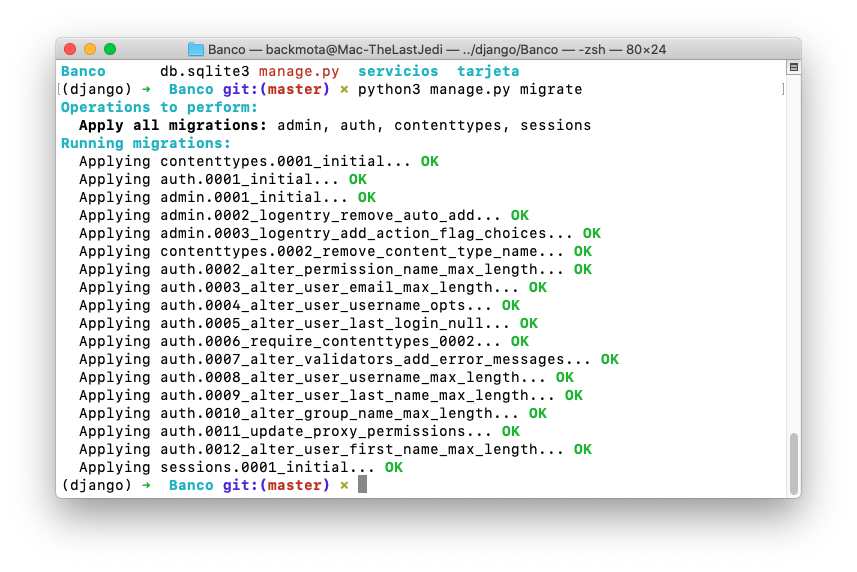
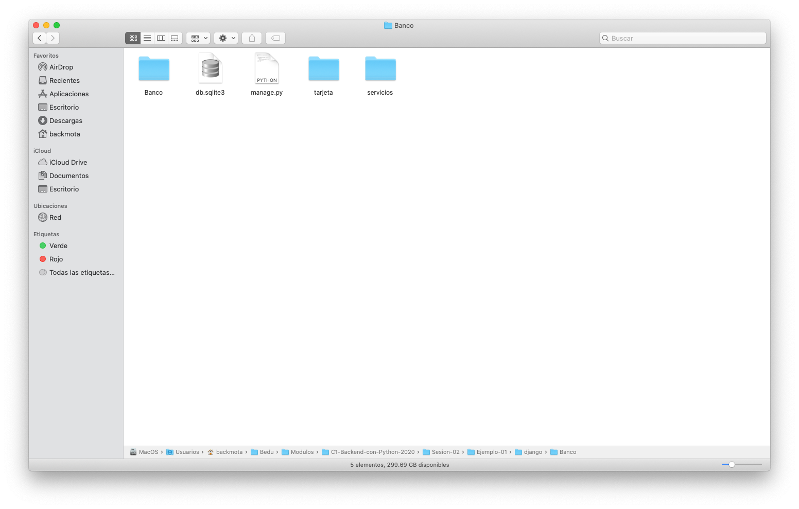
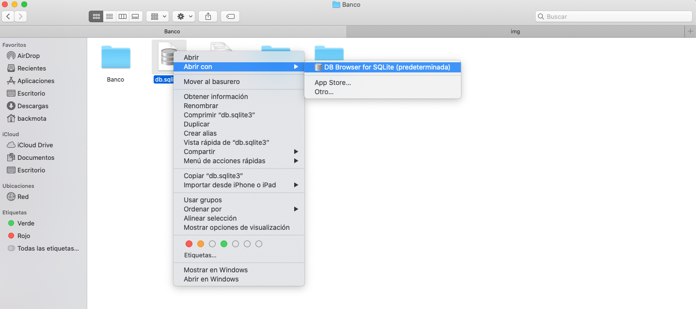
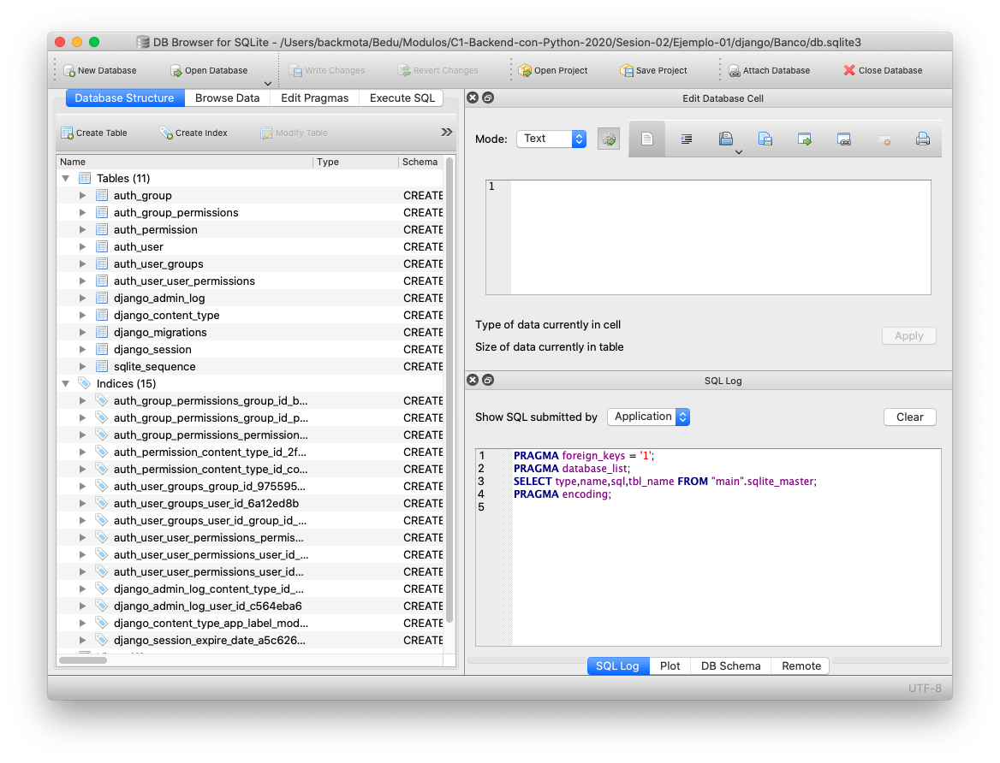

`Fullstack con Python` > [`Backend con Python`](../../Readme.md) > [`Sesión 02`](../Readme.md) > Ejemplo-01

## Inicializando Django con SQLite3

### OBJETIVOS

- Conocer el procedimiento para inicializar Django con SQLite3

#### REQUISITOS
1. Contar con el repositorio actualizado creado por el experto para este módulo.
1. Abrir una terminal y posicionarse en la carpeta de trabajo
2. Contar con [DB Browser for SQLite](https://sqlitebrowser.org) instalado 

### DESARROLLO
1. Django por defecto trabaja con SQLite por lo que no tendremos que hacer configuraciones especiales.

2. Abriremos nuestro proyecto

	```console
   $ cd django
   ```
	
3. Recordemos que es importante activar nuestro entorno virtual

	```console
   $ source bin/activate
   ```
   
   
4. Una vez activado procederemos a ingresar al directorio __Banco__

	```console
   $ cd Banco
   ```
   
   
   
5. Utilizaremos el siguiente comando para realizar la migración de nuestros módelos a nuestra base de datos:

	```console
   $ python3 manage.py migrate
   ```
   
    
     
6. Abriremos el directorio de nuestro proyecto __Banco__

	
	
7. Realizaremos clic derecho en el archivo __db.sqlite3__ y abiremos con __DB Browser for SQLite__

	
	
8. Visualizaremos que las tablas fueron creadas con exito 

	