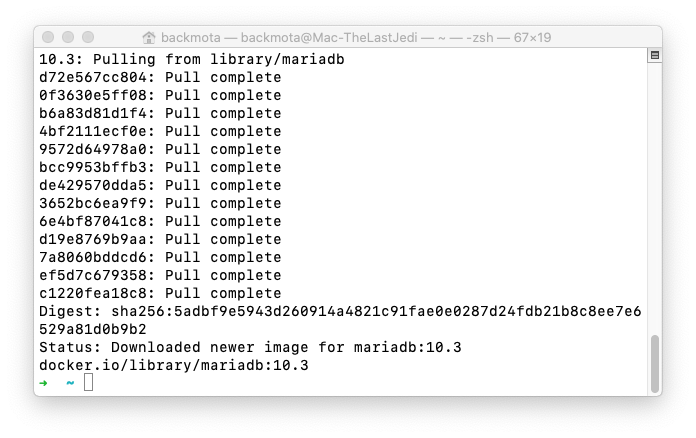
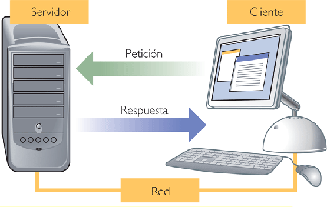
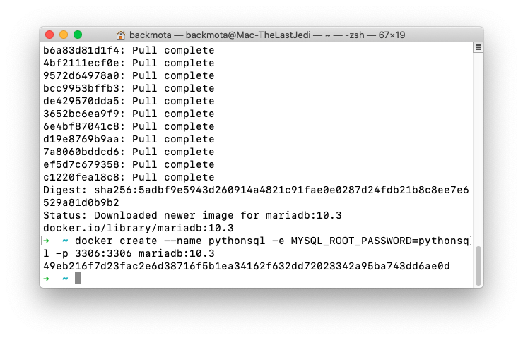
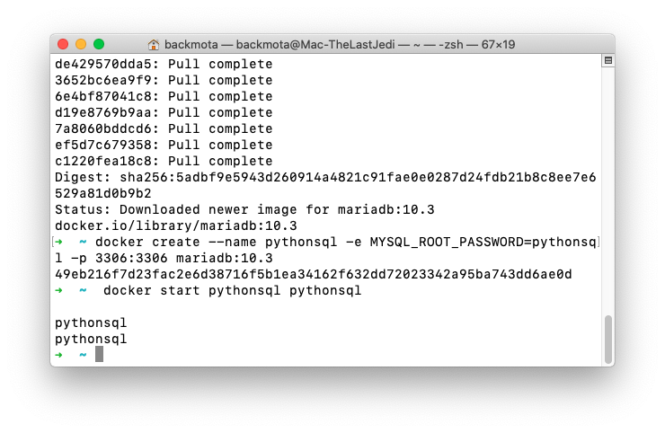
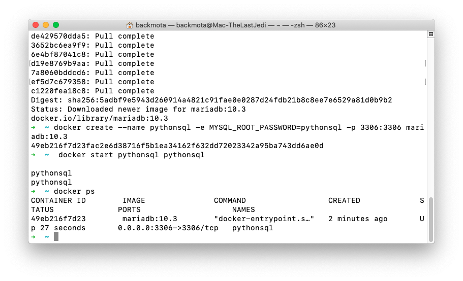

`Fullstack con Python` > [`Backend con Python`](../../Readme.md) > [`Sesión 02`](../Readme.md) > Ejemplo-04

## Inicializando un servidor MariaDB y una base de datos haciendo uso de contenedores

### OBJETIVOS
- Conocer el procedimiento para inicializar un servidor MariaDB usando contenedores con Docker.
- Conocer el procedimiento para inicializar la base de datos.
- Conocer el procedimiento para realizar una conexión a la base de datos.

#### REQUISITOS
1. Contar con Docker instalado
1. Contar con el repositorio actualizado creado por el experto para este módulo.
1. Abrir una terminal y posicionarse en la carpeta de trabajo `Backend-con-Python/Sesion-02/Ejemplo-04`:

   ```console
   $ cd Sesion-02/Ejemplo-04

   Sesion-02/Ejemplo-04 $
   ```

### DESARROLLO
1. Para poder hacer uso del servidor MariaDB por medio de Docker, lo primero que hay que hacer es descargar un archivo llamado imagen que contiene ya instalado MariaDB y usaremos la versión 10.3, por lo que usaremos el siguiente comando:

   __Ejecución de comando en terminal:__

   ```console
   Sesion-02/Ejemplo-04 $ docker pull mariadb:10.3
   10.3: Pulling from library/mariadb
   6abc03819f3e: Pull complete
   05731e63f211: Pull complete
   0bd67c50d6be: Pull complete
   ab62701212b1: Pull complete
   b1f6f41348ef: Pull complete
   3bdaf925d088: Pull complete
   10ba8f10417b: Pull complete
   3806bed5c691: Pull complete
   24aae6d0fc18: Pull complete
   9104943e23ec: Pull complete
   ae510462589d: Downloading  71.32MB/74.34MB
   ec23646ae61e: Download complete
   3c301b916a4e: Download complete
   Digest: sha256:db6e7bda67ea88efb00ba4ad82cb72dfee8938935914ae0948f6af523d398ca2
   Status: Downloaded newer image for mariadb:10.3

   Sesion-02/Ejemplo-04 $  
   ```
   ***
   
   

1. Responder a la pregunta ¿Qué es la arquitectura Cliente-Servidor? [Esto es una diapo]

   __Resultado__

   
   1. El Servidor presenta a todos los Clientes una interfaz única y bien definida.
   2. El Cliente no necesita saber la lógica y el funcionamiento del Servidor.
   3. El Cliente no depende de nada del Servidor, ni su ubicación, ni su tipo de equipo, ni su sistema operativo.
   4. Los cambios en el Servidor implican pocos o ningún cambio a los Clientes.
   5. Un Servidor puede atender a uno o más Clientes
   ***

1. Para crear un contenedor de un servidor de base de datos MariaDB son necesarios algunos parámetros, estos se pueden obtener desde el sitio de donde se descargó la imagen y otros se definen según la necesidad del proyecto:

   https://hub.docker.com/_/mariadb

   Entonces, antes de continuar se establecen los siguientes datos:
   - __Host:__ localhost (-h)
   - __User:__ root (-u)
   - __Password:__ pythonsql (-p, MYSQL_ROOT_PASSWORD)
   - __Nombre de contenedor:__ pythonsql (--name)
   - __Puerto:__ 3306 (-p)

   __El contenedor se crea con el siguiente comando:__

   ```console
   
   $ docker create --name pythonsql -e MYSQL_ROOT_PASSWORD=pythonsql -p 3306:3306 mariadb:10.3
   2bc444c9f01b9d157ac0e6bf13ce042cee1b7556ba328169453fea8800d285b1

   Sesion-02/Ejemplo-02 $
   ```
   ***
   
   

1. Para iniciar el servidor MariaDB hay que iniciar el contenedor llamado __pythonsql__:

   ```console
   Sesion-02/Ejemplo-02 $ docker start pythonsql
   pythonsql
   Sesion-02/Ejemplo-02 $ docker ps
   CONTAINER ID        IMAGE               COMMAND                  CREATED             STATUS              PORTS                    NAMES
46304152770a        mariadb:10.3        "docker-entrypoint.s…"   7 days ago          Up 26 hours         0.0.0.0:3306->3306/tcp   pythonsql
   ```
   ***
   
   
   

1. Para inicializar la base de datos se ejecuta el comando `mysql` haciendo uso del contenedor Docker, leyendo las instrucciones SQL desde el archivo `sql/biblioteca.sql` usando los datos definidos anteriomente.

   __El comando a ejecutar es:__
   ```console
   Sesion-02/Ejemplo-04 $ docker exec -i pythonsql mysql -hlocalhost -uroot -ppythonsql < sql/biblioteca.sql

   Sesion-02/Ejemplo-04 $
   ```

   En apariencia no ha sucedido nada, pero con este comando se ha creado la base de datos para el proyecto Biblioteca con los siguientes datos:
   - __Host:__ localhost
   - __User:__ Biblioteca
   - __Pass:__ Biblioteca
   - __Base:__ Biblioteca
   ***

1. Para validar que la base de datos se haya inicializado de forma correcta se realiza una conexión a la base de datos con el siguiente comando:

  ```console
  Sesion-02/Ejemplo-04 $ docker exec -it pythonsql mysql -hlocalhost -uBiblioteca -pBilioteca Biblioteca
  Welcome to the MariaDB monitor.  Commands end with ; or \g.
  Your MariaDB connection id is 9
  Server version: 10.3.15-MariaDB-1:10.3.15+maria~bionic mariadb.org binary distribution

  Copyright (c) 2000, 2018, Oracle, MariaDB Corporation Ab and others.

  Type 'help;' or '\h' for help. Type '\c' to clear the current input statement.

  MariaDB [Biblioteca]> EXIT;

  Sesion-02/Ejemplo-04 $
  ```
  ***

Si has llegado hasta este punto __FELICIDADES__, toma un respiro o ayuda a algún compañero que no lo haya logrado aún
