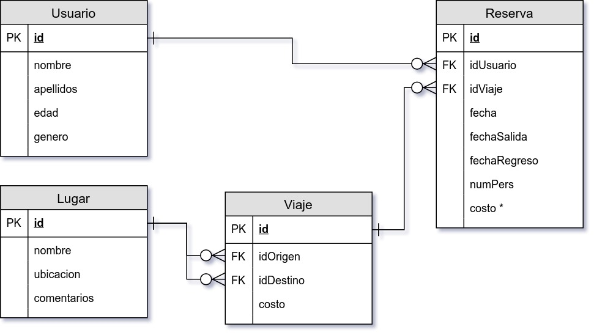

`Fullstack con Python` > [`Backend con Python`](../../Readme.md) > [`Sesión 01`](../Readme.md) > Proyecto
## Consulta de datos en una relación de dos o más tablas con Python

### OBJETIVO
Construir un script en Python que realice consulta de datos en dos o más tablas para el proyecto BeduTravels.

### REQUISITOS
1. Carpeta de repo actualizada
1. Usar la carpeta de trabajo `Sesion-01/Proyecto`
1. Usar el diagrama del modelo entidad-relación:

   

#### DESARROLLO
1. Crear el script `lista-viajes.py` que imprima la lista de todos los viajes reservados, incluyendo Reserva.id, Usuario.nombre, fechaSalida, fechaRegreso, numPers, Origen.nombre y Destino.nombre.

   __Nota:__ Se recomienda hacer uso de los módulos click, datetime, modelomysql y stdout.

   __Ejecutando el script:__

   ```bash
   Sesion-01/Proyecto $ python lista-viajes.py

   Lista de viajes reservados
   --------------------------
   Id | Usuario | Fecha salida | Fecha regreso | Num. Personas | Origen | Destino    
    1 | Daisy   | 2019-06-05   | 2019-06-12    |             1 | CDMX   | Guadalajara
    2 | Goku    | 2019-06-10   |               |             4 | Puebla | Oaxaca     
    3 | Daisy   | 2019-06-10   |               |             1 | Puebla | Oaxaca     
    4 | Chabelo | 2019-06-15   |               |             2 | Puebla | Michoacán  
   --------------------------
   ```

   __Super reto:__ Listar la lista de viajes reservados en formato html

   ```bash
   Sesion-01/Proyecto $ python lista-viajes.py --html > lista-viajes.html
   ```

   __Vista del resultado en navegador:__

   
   ***
