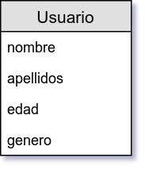

`Fullstack con Python` > [`Backend con Python`](../../Readme.md) > [`Sesión 01`](../Readme.md) > Reto-02
## Operación READ: Lectura de datos con Python y MariaDB

### OBJETIVO
Realizar la operación __Read__ a una tabla en un servidor MariaDB desde Python para el proyecto BeduTravels

#### REQUISITOS
1. Contar con los datos de conexión a la base de datos BeduTravels.

   __Host:__ localhost
   __User:__ BeduTravels \
   __Password:__ BeduTravels \
   __Base de datos:__ BeduTravels

1. Usar la carpeta de trabajo `Sesion-01/Reto-02`

   ```console
   $ cd Sesion-01/Reto-02

   Sesion-01/Reto-02 $
   ```

1. Crear la tabla __Usuario__ e insertar datos desde el archivo `sql/tabla-usuario.sql`

   

   ```console
   Sesion-01/Reto-02 $ docker exec -i pythonsql mysql -hlocalhost -uroot -ppythonsql < sql/tabla-usuario.sql

   Sesion-01/Reto-02 $
   ```

### DESARROLLO
1. __OPERACIÓN READ__ Realizar las modificaciones necesarias en los scripts `lista-registros.py` y `modelomysql.py` para que se imprima en la salida estándar la lista de registros de la tabla proporcionada por el usuario:

   __Caso: Ejecutando el script sin argumentos__

   ```console
   Sesion-01/Reto-02 $ python lista-registros.py

   Tablas disponibles
   ------------------
   Usuario
   ------------------
   ```

   __Caso: Imprimiendo registros de la tabla Usuario__

   ```console
   Sesion-01/Reto-02 $ python lista-registros.py Usuario

   Tabla: Usuario
   --------------
   Id | Nombre | Apellidos | Edad | Genero
    1 | Hugo   | Mac Rico  |   10 | M     
    2 | Paco   | Mac Rico  |   15 | M     
    3 | Daisy  | Mac Rico  |   18 | H     
   --------------
   ```
   ***

__Nota:__ Este reto se realiza en 3 mins o menos.
