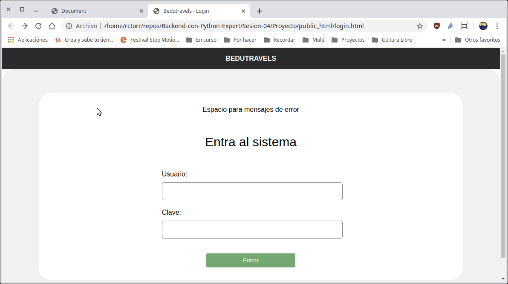
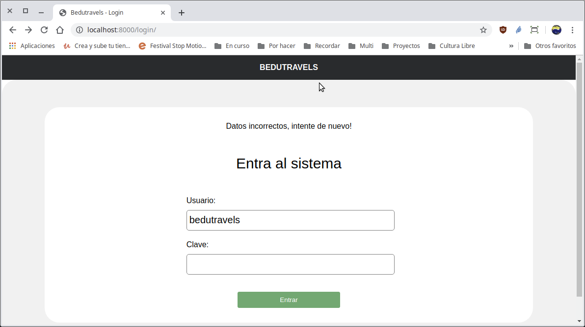

[`Backend con Python`](../../Readme.md) > [`Sesión 03`](../Readme.md) > Proyecto
## Definiendo y agregando una página con formulario de la aplicación web

### OBJETIVO
- Crear la ruta y vista para generar el formulario de login
- Crear la ruta y vista para procesar la información de un formulario vía POST

### REQUISITOS
1. Actualizar repositorio
1. Usar la carpeta de trabajo `Sesion-03/Proyecto`
1. Diagrama del modelo entidad-relación para el proyecto __Bedutravels__

   

### DESARROLLO
Dada la url `http://localhost/login/` se deberá mostrar la siguiente página para hacer __login__ al sistema:



Y posteriormente al proporcionar el usuario __bedutravels__ y clave __bedutravels__ deberá mostrar la página de inicio o un mensaje de error en caso de que no se proporciones los datos de forma correcta.

1. Crear la ruta para la url `/login/`

   __Se modifica el archivo `Bedutravels/tours/urls.py` agregando la línea siguiente:__

   ```python
   path("login/", views.login, name="login"),
   ```
   ***

1. Crear la vista `views.login`

   __Se modifica el archivo `Bedutravels/tours/views.py` agregando las función login():__

   ```python
   def login(request):
       """ Atiende las peticiones de GET /login/ """

       msg = ""

       return render(request, "registration/login.html",
           {
               "msg":msg,
           }
       )
   ```
   ***

1. Crear la plantilla `login.html`

   __Se crea el archivo `Bedutravels/tours/templates/tours/registration/login.html` copiándolo desde la carpeta `Bedutravels/public_html/` y se modifica de la siguiente forma:

   ```html
   <section class="profile-container padding-top-lg" style="height: -webkit-fill-available;">
     <div>
       
       <aside class="text-center">
         {{ msg }}
       </aside>
       
       <div class="margin-bottom-sm">
         <p class="title-font margin-bottom-lg margin-top-lg text-center">Entra al sistema</p>
       </div>
       <div class="profile-info">
         <form class="profile-inputs" method="post">
               
               Usuario: <input type="text" name="usuario" value="" required>
               Clave: <input type="password" name="clave" value="" required>
               <button class="button-tour margin-top-sm" style="align-self: center; width:50%;" type="submit" name="button">
                 Entrar
               </button>
         </form>
       </div>
     </div>
   </section>
   ```
   No olvidar la etiqueta `csrf_token`, ya que de lo contrario el contenido del formulario no será aceptado por parte de Django.

   Finalmente se obtiene el formulario esperado! Hooo noooo?
   ***

1. Agregando los archivos de estilos

   Es necesario copiar dos archivos de estilos más desde la carpeta `Bedutravels/public_html/css/`, que son `forms.css` y `profile.css` a la carpeta `Bedutravels/tours/static/tours/css/`

   ```console
   Bedutravels/tours/static/tours $ cp ../../../public_html/css/forms.css css/
   Bedutravels/tours/static/tours $ cp ../../../public_html/css/profile.css css/
   Bedutravels/tours/static/tours $
   ```
   Recargar nuevamente la página (posiblemente sea necesario usar Control+Shift+R) y ahora si la página ya tiene que verse de forma correcta.

   Ahora hay que procesar los datos recibidos del formulario
   ***

1. Ajustar la vista `views.login` para que valide los datos del formulario.

   __Se procesan los datos POST en la vista:__

   ```python
   # Se definen los datos de un usuario válido
   usuario_valido = ("bedutravels", "bedutravels")  # (username, password)

   # Si hay datos vía POST se procesan
   if request.method == "POST":
       # Se obtienen los datos del formulario
       usuario_form = (request.POST["username"],
           request.POST["password"])
       if usuario_form == usuario_valido:
           # Tenemos usuario válido, redireccionamos a index
           return redirect("/")
       else:
           # Usuario malo
           msg = "Datos incorrectos, intente de nuevo!"
   else:
       # Si no hay datos POST
       msg = ""
   ```
   Y así se debería de ver cuando el usuario es incorrecto:
      
   ***
