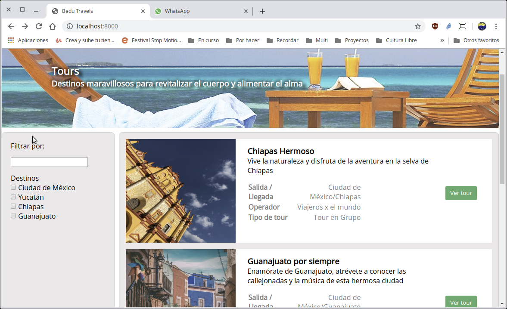

[`Backend con Python`](../../Readme.md) > [`Sesión 03`](../Readme.md) > Reto-04
## El sistema de plantillas de Django

### OBJETIVO
- Hacer uso del sistema de consultas de Django.
- Aplicar las consultas en las plantillas de Django.

### REQUISITOS
1. Actualizar repositorio
1. Usar la carpeta de trabajo `Sesion-03/Reto-04`
1. Diagrama del modelo entidad-relación para el proyecto __Bedutravels__

   

### DESARROLLO
El RETO consiste en modificar la página de inicio, en su columna izquierda para que en la lista de Destinos, muestre la lista de Zonas disponibles.

1. Modificar la vista `index()` para incluir la lista de todas las Zonas:

   __Realizando cambios al archivo `Bedutravels/tours/views.py`:__
   ```python
   from .models import Zona, Tour

   # Create your views here.
   def index(request):
       """ Vista para atender la petición de la url / """
       # Obteniendo los datos mediantes consultas
       tours = Tour.objects.all()
       zonas = Zona.objects.all()

       return render(request, "tours/index.html", {"tours":tours, "zonas":zonas})
   ```
   ***

1. Modificar la plantilla `index.html` para que haga uso de los resultados obtenidos en la vista:

   __Realizando cambios al archivo `Bedutravels/tours/template/tours/index.html`:__
   ```html
   <aside id="column-left">
     <p class="margin-bottom-sm">Filtrar por:</p>
     <input class="margin-bottom-sm" type="text" name="" value="">
     <div class="margin-bottom-sm">
       <p>Destinos</p>
         <ul>
           
           <li>
             <input type="checkbox" id="fruit4" name="zona" value="{{ zona.id }}">
             <label for="fruit4">{{ zona }}</label>
           </li>
           
         </ul>
      </div>
    </aside>
   ```
   ***

__Resultado final:__


