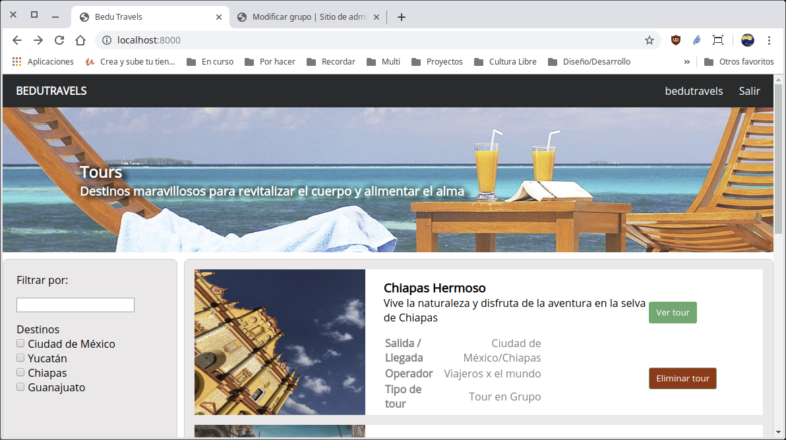
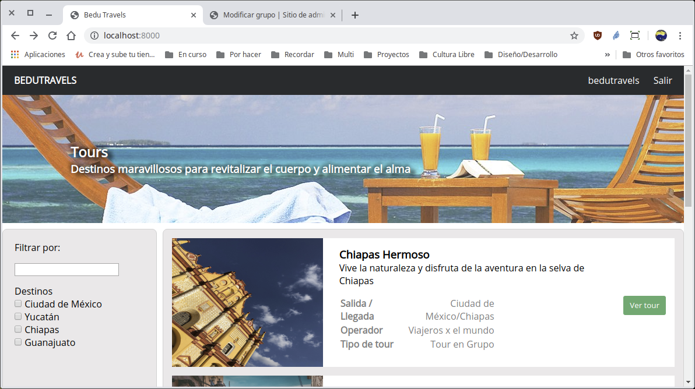
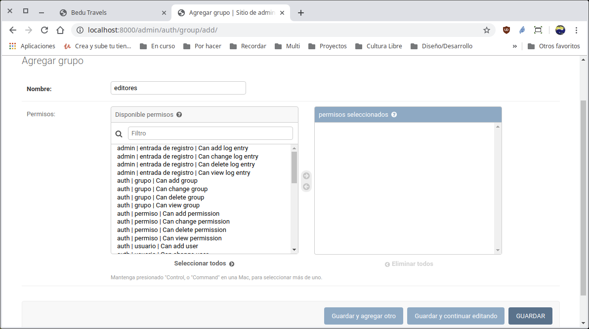
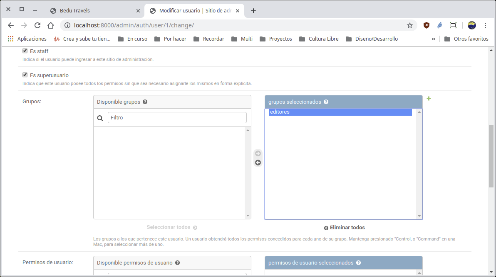
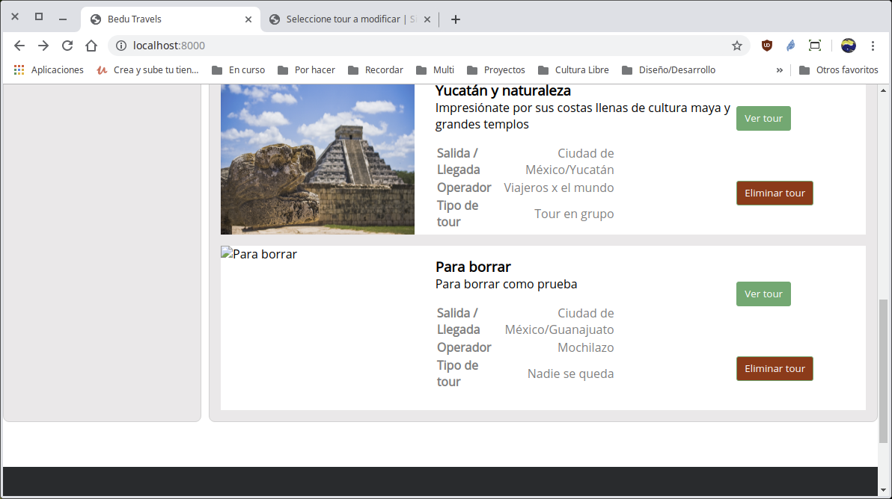

[`Backend con Python`](../../Readme.md) > [`Sesión 04`](../Readme.md) > Proyecto
## Definiendo elementos necesarios para otorgar permisos para eliminar datos.

### OBJETIVO
- Crear la ruta y vista para eliminar un registro de una Tabla.
- Definir permisos en base a grupos para la eliminación de registros.

### REQUISITOS
1. Actualizar repositorio
1. Usar la carpeta de trabajo `Sesion-04/Proyecto`
1. Los requerimientos consisten en que en base al maquetado de la página web de inicio mostrado en la imagen, realizar lo siguiente:
   - La opción para borrar un registro sólo aparece si el usuario pertenece al grupo __editores__
   - En cuando se dé click en el botón __Eliminar tour__, se hará una llamada a la url `/tour/eliminar/idTour/` para eliminar el Tour seleccionado.
   - Se redirecciona a la página de inicio

   

### DESARROLLO
1. Lo primero es agregar una opción para borrar un __Tour__ si el usuario pertenece el grupo __editores__.

   __Modificando la plantilla `index.html` como sigue:__

   ```html
   <div class="buttons-tour">
     <div>
       <a href="/tour/{{ tour.id }}/">
         <button class="button-tour">Ver tour</button>
       </a>
     </div>
     <div>
       <a href="/tour/eliminar/{{ tour.id }}/">
         <button class="eliminar-tour">Eliminar tour</button>
       </a>
     </div>
   </div>
   ```
   Esto deberá mostrar el botón __Eliminar tour__ como se muestra a continuación:

   

1. En el paso anterior, el botón se muestra, pero uno de los requerimientos es que sólo los usuarios en el grupo __editores__ seán quienes puedan eliminar, así que el botón debe aparecer sólo cuando el usuario pertenece al grupo mencionado, así que se agrega una condición al código html del archivo `index.html` como sigue:

   ```html
   
   <div>
     <a href="/tour/eliminar/{{ tour.id }}/">
       <button class="eliminar-tour">Eliminar tour</button>
     </a>
   </div>
   
   ```
   Ahora se obtiene lo siguiente porque la variable `es_editor` no está definida en la vista:

   
   ***   

1. Se modifica la vista `index()` para que se agregue la variable `es_editor` al contexto de la plantilla:

   ```python
   # Se determina si el usuario pertenece o no al grupo editores
   es_editor = request.user.groups.filter(name="editores").exists()

   return render(request, "tours/index.html",
       {"tours":tours, "zonas":zonas, "es_editor":es_editor})
   ```
   si en este momento se actualiza la página de tours se verá exactamente lo mismo, así que antes de ello se procede a agregar el grupo __editores__ usando el administrador de Django:

   

   Luego se modifica el usuario __bedutravels__ para que pertenezca al grupo __editores__

   

   Si se recarga la página de inicio ya se debería de observar el botón de __eliminar tour__.
   ***

1. Después de las modificaciones anteriores ahora cada tour tiene la acción para poder ser eliminado usando una url `/tour/eliminar/idTour/` por lo que se tiene que crear la ruta y vistas respectivas:

   __Creando la ruta para atender la url mencionada por lo que se agrega el siguiente código al archivo `Bedutravels/tours/urls.py`__

   ```python
   path("tour/eliminar/<int:idTour>/",
       views.eliminar_tour, name="eliminar_tour"),
   ```
   Notas como el sistema de rutas de Django nos permite agregar variables en las url's y además indicar el tipo de dato. Ver https://docs.djangoproject.com/en/2.2/topics/http/urls/

   __Creando la vista correspondiente en el archivo `Bedutravels/tours/views.py`:__

   ```python
   @login_required()
   def eliminar_tour(request, idTour):
       """
       Atiende la petición GET
          /tour/eliminar/<int:idTour>/
       """
       # Se obtienen los objetos correspondientes a los id's
       tour = Tour.objects.get(pk=idTour)

       # Se elimina el tour
       tour.delete()

       return redirect("/")
   ```
   Notar que la vista incluye del decorador `@login_required()` ya que no cualquiera puede eliminar un libro de un préstamo, así que ahora agregaremos los permisos usando el grupo __eliminar__.

   Se sugiere agregar otro __Tour__ de prueba desde el administrador de Django y luego proceder a eliminarlo desde la página de la lista de tours.

   
   ***
