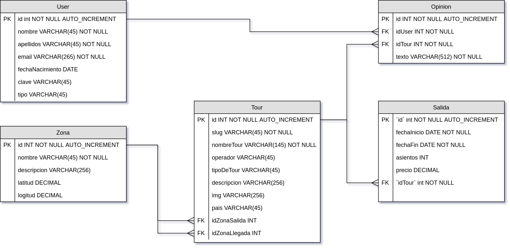
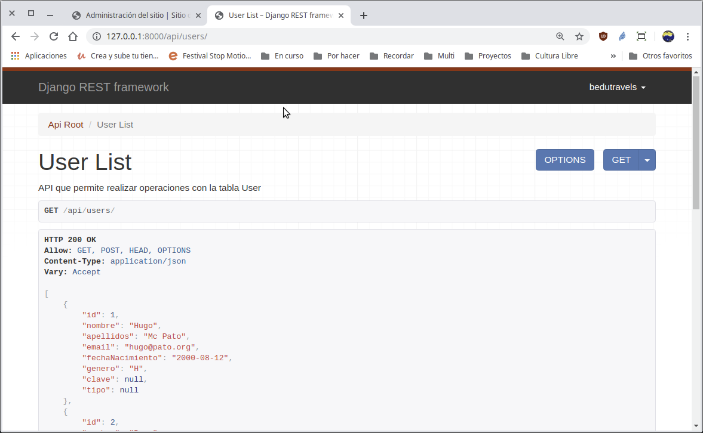
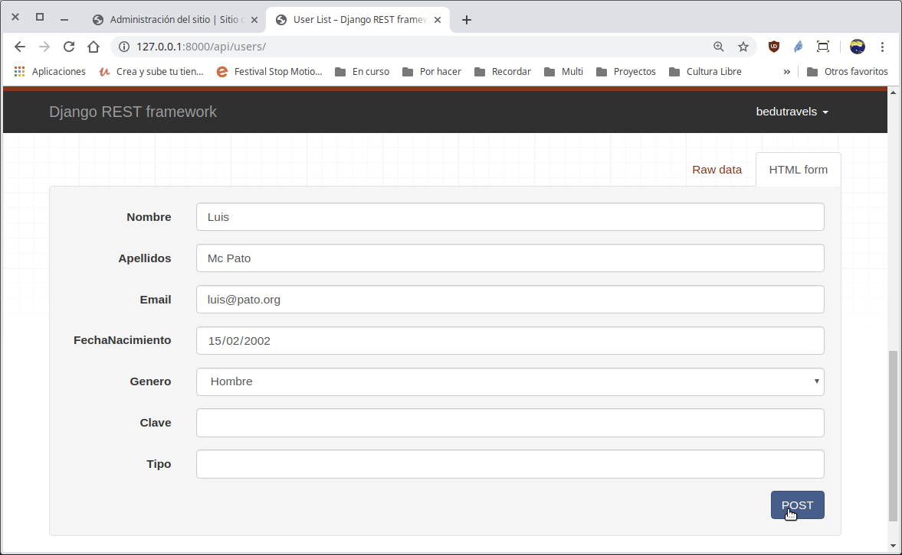
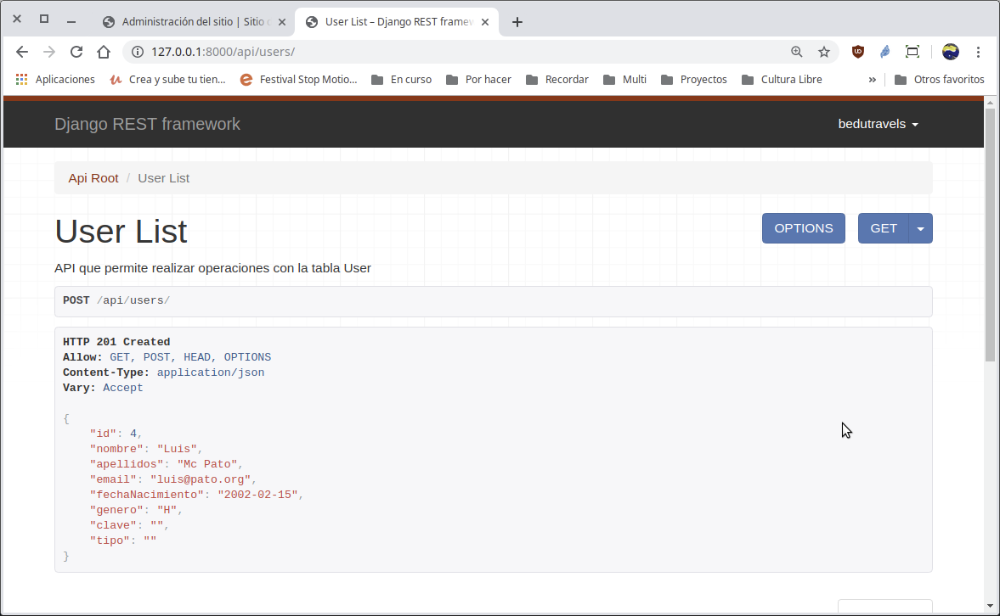

`Fullstack con Python` > [`Backend con Python`](../../Readme.md) > [`Sesión 05`](../Readme.md) > Ejemplo-02
## Creando un API para realizar las operaciones CRUD de una tabla tipo catálogo.

### OBJETIVOS
- Configurar Django Rest Framework
- Definir la url para el modelo __User__ en el __API__
- Integrar Django Rest Framework en el proyecto Bedutravels
- Realizar operaciones de CRUD vía API

### REQUISITOS
1. Actualizar repositorio
1. Usar la carpeta de trabajo `Sesion-05/Ejemplo-02`
1. Activar el entorno virtual __Bedutravels__
1. Diagrama de entidad-relación del proyecto Bedutravels

   

### DESARROLLO
1. Agregando Django Rest Framework a la configuración en el archivo `settings.py` como una aplicación adicional:

   ```python
   INSTALLED_APPS = [
       'django.contrib.admin',
       'django.contrib.auth',
       'django.contrib.contenttypes',
       'django.contrib.sessions',
       'django.contrib.messages',
       'django.contrib.staticfiles',
       'bedutravels',
       'rest_framework',
   ]
   ```
   ***

1. Se crea la ruta para la url `/api/users` modificando el archivo `Bedutravels/Bedutravels/urls.py`:

   ```python
   # Imports
   from django.contrib.auth import views as auth_views
   from django.urls import path, include
   from rest_framework import routers

   from . import views

   # Agregando rutas para django rest
   router = routers.DefaultRouter()
   router.register(r'users', views.UserViewSet)
   [...]
   # Rutas para la url /api/
   path("api/", include(router.urls)),
   # Rutas para la autenticación url /api/auth/
   path("api/auth/", include("rest_framework.urls", namespace="rest_framework")),
   [...]
   ```
   ***

1. Se crea la vista para el api de la tabla __User__ aunque en este caso en lugar de generar y regresar HTML será JSON.

   __Abrir el archivo `Bedutravels/tours/views.py` y agregar el siguiente contenido:__

   ```python
   # Imports
   from django.contrib.auth import authenticate, login, logout
   from django.contrib.auth.decorators import login_required
   from django.shortcuts import render, redirect

   from .models import User, Zona, Tour, Opinion, Salida
   from .serializers import UserSerializer

   from rest_framework import viewsets

   import datetime

   [...al final agregar...]
   # Vistas basadas en clases para Django Rest
   class UserViewSet(viewsets.ModelViewSet):
      """
      API que permite realizar operaciones en la tabla User
      """
      # Se define el conjunto de datos sobre el que va a operar la vista,
      # en este caso sobre todos los users disponibles.
      queryset = User.objects.all().order_by('id')
      # Se define el Serializador encargado de transformar la peticiones
      # en formato JSON a objetos de Django y de Django a JSON.
      serializer_class = UserSerializer
   ```
   ***

1. Se crea el serializador `UserSerializer` en el archivo `Bedutravels/tours/serializers.py`.

   ```python
   from rest_framework import serializers

   from .models import User

   class UserSerializer(serializers.HyperlinkedModelSerializer):
       """ Serializador para atender las conversiones para User """
       class Meta:
           # Se define sobre que modelo actua
           model = User
           # Se definen los campos a incluir
           fields = ('id', 'nombre', 'apellidos', 'email', 'fechaNacimiento', 'genero', 'clave', 'tipo')
   ```
   ***

1. Acceso y uso de la __API__ `/api/users`

   __Para tener acceso al API abrir la siguiente url:__

   http://localhost:8000/api/users/

   Se deberá de observar algo similar a lo siguiente:

   

   __Agregando un nuevo usuario vía web:__

   

   

   __Agregando un nuevo usuario vía consola:__

   ```console
   (Bedutravels) Ejemplo-02 $ curl -d '{"nombre": "Donald", "apellidos": "Mac Pato", "email":"donald@pato.org", "fechaNacimiento":"2000-01-01", "genero": "H"}' -H 'Content-Type: application/json' http://localhost:8000/api/users/
   {"id":5,"nombre":"Donald","apellidos":"Mac Pato","email":"donald@pato.org","fechaNacimiento":"2000-01-01","genero":"H","clave":null,"tipo":null}

   (Bedutravels) Ejemplo-02 $
   ```
   Notar que esto genera una petición POST y como resultado se obtiene el usuario agregado con el id asignado.

   También se puede verificar actualizando la lista de Users en la vista del api del navegador.

   __Creando el usuario Pluto vía consola:__

   ```console
   (Bedutravels) Ejemplo-02 $ curl -d '{"nombre": "Pluto", "apellidos": "Mac Perro", "email":"pluto@pato.org", "fechaNacimiento":"2000-01-01", "genero": "H"}' -H 'Content-Type: application/json' http://localhost:8000/api/users/
   {"id":6,"nombre":"Pluto","apellidos":"Mac Perro","email":"pluto@pato.org","fechaNacimiento":"2000-01-01","genero":"H","clave":null,"tipo":null}
   ```

   __Eliminando el usuario Pluto vía consola:__

   ```console
   (Bedutravels) Ejemplo-02 $ curl -X DELETE http://localhost:8000/api/users/6/

   (Bedutravels) Ejemplo-02 $
   ```
   Sin más el usuario se elimina y se puede verificar en la vista web.
