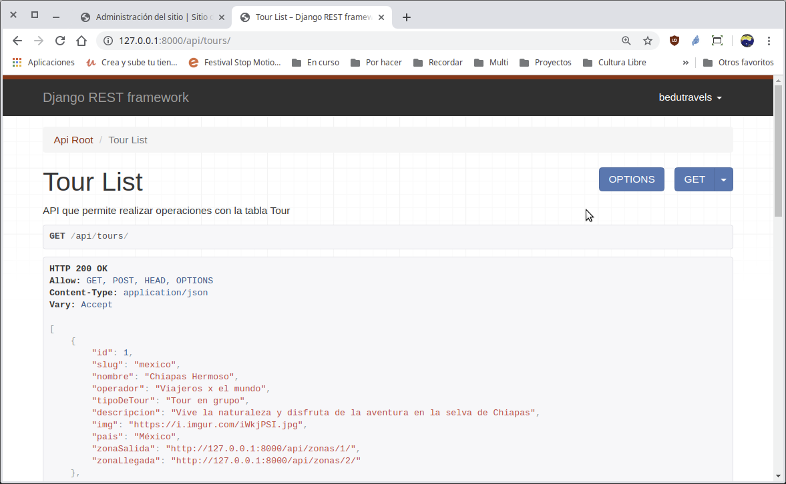
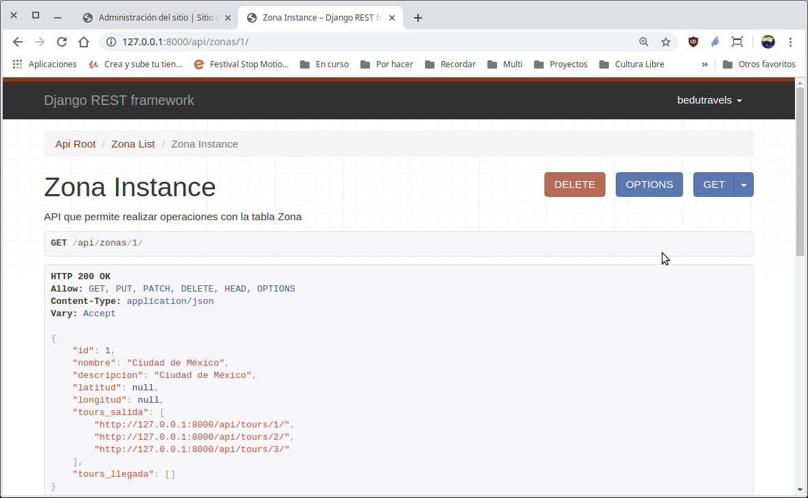

`Fullstack con Python` > [`Backend con Python`](../../Readme.md) > [`Sesión 05`](../Readme.md) > Ejemplo-03
## Creando un API para realizar las operaciones CRUD de una tabla con relaciones uno a muchos.

### OBJETIVOS
- Agregar el modelo __Tour__ a el __API__ de la Bedutravels
- Realizar operaciones de CRUD vía API para la tabla __Tour__

### REQUISITOS
1. Actualizar repositorio
1. Usar la carpeta de trabajo `Sesion-05/Ejemplo-03`
1. Activar el entorno virtual __Bedutravels__
1. Diagrama de entidad-relación del proyecto Bedutravels

   

### DESARROLLO
1. Se crea la ruta para la url `/api/tours` modificando el archivo `Bedutravels/Bedutravels/urls.py`:

   ```python
   router.register(r'tours', views.TourViewSet)
   ```
   ***

1. Se crea la vista para el api de la tabla __Tour__ aunque en este caso en lugar de generar y regresar HTML será JSON.

   __Abrimos el archivo `Bedutravels/tours/views.py` y agregar el siguiente contenido:__

   ```python
   from .serializers import UserSerializer, ZonaSerializer ,TourSerializer

   [...al final agregar...]
   class TourViewSet(viewsets.ModelViewSet):
      """
      API que permite realizar operaciones en la tabla Tour
      """
      # Se define el conjunto de datos sobre el que va a operar la vista,
      # en este caso sobre todos los tours disponibles.
      queryset = Tour.objects.all().order_by('id')
      # Se define el Serializador encargado de transformar la peticiones
      # en formato JSON a objetos de Django y de Django a JSON.
      serializer_class = TourSerializer
   ```
   ***

1. Se crea el serializador `TourSerializer` en el archivo `Bedutravels/tours/serializers.py`.

   ```python
   from .models import User, Zona, Tour

   class TourSerializer(serializers.HyperlinkedModelSerializer):
       """ Serializador para atender las conversiones para Tour """
       class Meta:
           # Se define sobre que modelo actúa
           model = Tour
           # Se definen los campos a incluir
           fields = ('id', 'nombre', 'slug', 'operador', 'tipoDeTour',
            'descripcion', 'img', 'pais', 'zonaSalida', 'zonaLlegada')


   class ZonaSerializer(serializers.HyperlinkedModelSerializer):
       """ Serializador para atender las conversiones para Zona """

       # Se define la relación de una zona y sus tours realizados
       tours = TourSerializer(many=True, read_only=True)

       class Meta:
           # Se define sobre que modelo actúa
           model = Zona
           # Se definen los campos a incluir
           fields = ('id', 'nombre', 'descripcion', 'latitud', 'longitud', 'tours_salida', 'tours_llegada')
   ```
   __Nota:__ Es importante el nuevo orden de las clases
   ***

1. Acceso y uso de la __API__ `/api/tours`

   __Para tener acceso al API abrir la siguiente url:__

   http://localhost:8000/api/tours/

   Se deberá de observar algo similar a lo siguiente:

   

   __Para tener acceso a la lista de tours de la zona con id=1 abrir la siguiente url:__

   http://localhost:8000/api/zonas/1/

   Se deberá de observar algo similar a lo siguiente:

   
