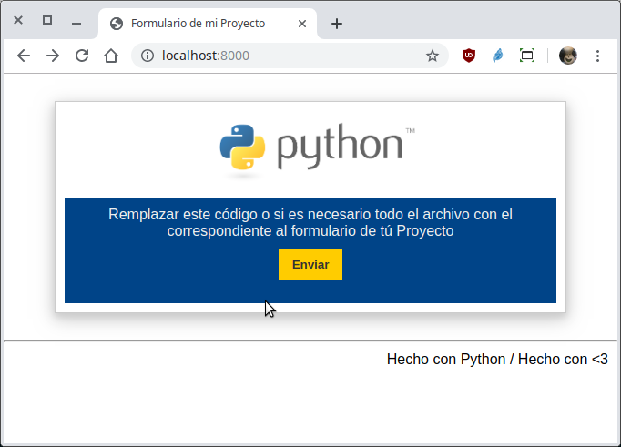
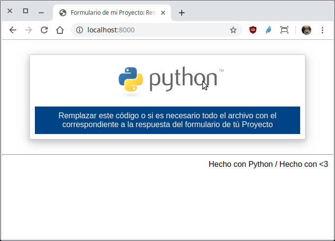

`Fullstack con Python` > [`Backend con Python`](../../Readme.md) > [`Sesión 02`](../Readme.md) > Postwork
## Aplicar los conceptos de la clase a un Proyecto

### OBJETIVOS
 - Crear una micro aplicación web con Bottle que permita atender la petición de un formulario y su respuesta para tu Proyecto.
 - Aplicar los conceptos de Petición, Ruta y Vista.

#### REQUISITOS
1. Constar con la carpeta del repo actualizada.
1. Contar con las páginas del formulario y su respuesta en HTML y CSS.
1. Usar la carpeta de trabajo `Sesion-02/Postwork`

   ```sh
   $ cd Sesion-02/Postwork

   Sesion-02/Postwork $
   ```

### DESARROLLO
1. Aplicando los frameworks: Crear la aplicación web `webapp/index.py` que muestre un formulario donde se capturen algunos campos relacionados con tú Proyecto. Cuando el formulario sea enviado, se mostrará una respuesta con un mensaje y opcionalmente los valores los campos capturados, eso dependerá de como esté definido en tú Proyecto.

   __Cambiarse a la carpeta `webapp`:__
   ```console
   Sesion-02/Postwork $ cd webapp
   Sesion-02/Postwork/webapp $
   ```

   __Ejecutando el script con:__

   ```console
   Sesion-02/Postwork/webapp $ python index.py
   Bottle v0.13-dev server starting up (using WSGIRefServer())...
   Listening on http://localhost:8000/
   Hit Ctrl-C to quit.
   ```

   Se puede acceder abriendo la siguiente url en algún navegador:
   - http://localhost:8000

   __Formulario a llenar:__

   

   __Respuesta al formulario:__

   
   ***
