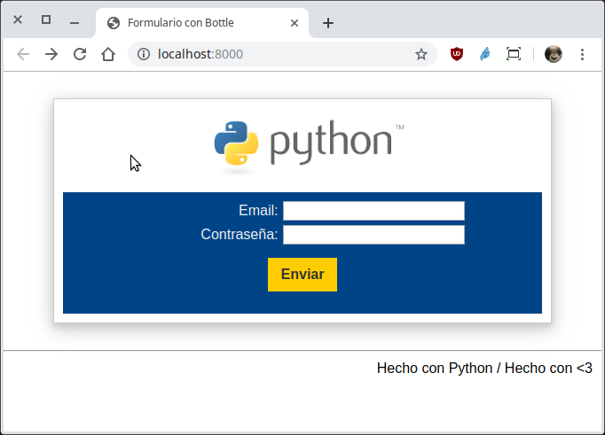
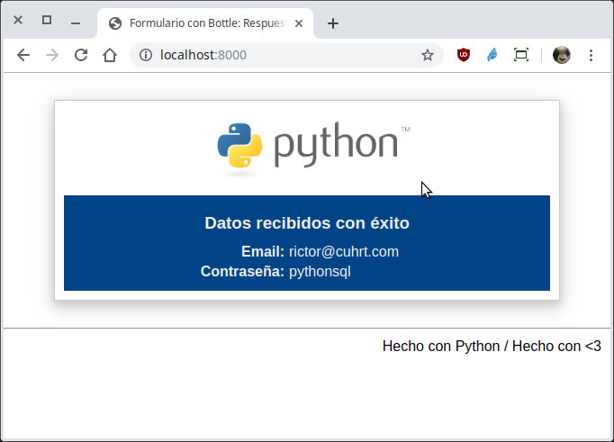

`Fullstack con Python` > [`Backend con Python`](../../Readme.md) > [`Sesión 02`](../Readme.md) > Proyecto

## Conociendo los micro frameworks creando una micro aplicación web con Bottle.

### OBJETIVOS
- Conocer el flujo de información entre una petición POST desde el Navegador hasta la aplicación web creada usando el micro framework Bottle.

#### REQUISITOS
1. Actualizar repositorio

#### DESARROLLO
1. Entendiendo a los frameworks: Creando la aplicación web `webapp/index.py` que muestre un formulario donde se capturen dos campos, email y contraseña. Cuando el formulario sea enviado, se mostrará una respuesta con un mensaje y los valores los campos capturados.

   __Cambiarse a la carpeta `webapp`:__
   ```console
   Sesion-02/Proyecto $ cd webapp
   Sesion-02/Proyecto/webapp $
   ```

   __Ejecutando el script con:__

   ```console
   Sesion-02/Proyecto/webapp $ python index.py
   Bottle v0.13-dev server starting up (using WSGIRefServer())...
   Listening on http://localhost:8000/
   Hit Ctrl-C to quit.
   ```

   Se puede acceder abriendo la siguiente url en algún navegador:
   - http://localhost:8000

   __Formulario a llenar:__

   

   __Respuesta al formulario:__

   
   ***
