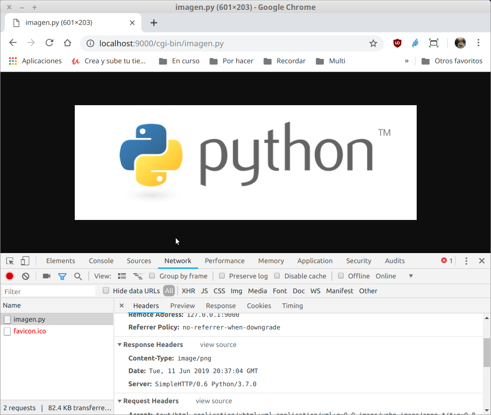

`Fullstack con Python` > [`Backend con Python`](../../Readme.md) > [`Sesión 02`](../Readme.md) > Reto-01
## Conociendo el protocolo HTTP por medio de una micro aplicación Python

### OBJETIVO
Definir el flujo de información en una petición HTTP para obtener una imagen entre el cliente y una aplicación web creada en Python.

#### REQUISITOS
1. Actualizar repositorio

#### DESARROLLO
1. Iniciando un micro servidor web con Python

   __Cambiarse a la carpeta `html` del `Reto-01`:__
   ```console
   Sesion-02/Reto-01 $ cd html
   Sesion-02/Reto-01/html $
   ```

   __Crear el servidor con la instrucción:__
   ```console
   Sesion-02/Reto-01/html $ python -m http.server --cgi
   Serving HTTP on 0.0.0.0 port 8000 (http://0.0.0.0:8000/) ...
   ```
   ***

1. Crear el script `imagen.py` en la carpeta `html/cgi-bin/` para que atienda la petición http://localhost:8000/cgi-bin/imagen.py que deberá de mostrar el contenido del archivo `html/img/python-logo.png` en el navegador.

   __Resultado en el navegador:__

   

   __TIPS:__
   - Recuerda agregar el MIMEType adecuado para la imagen
   - Se recomienda hacer uso del módulo os y su función write, ver documentación en https://docs.python.org/3/library/os.html#os.write
