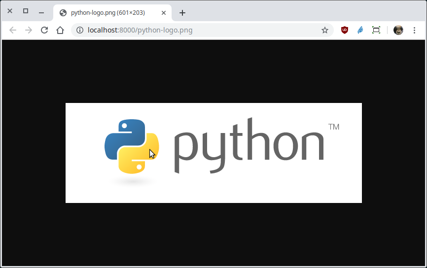
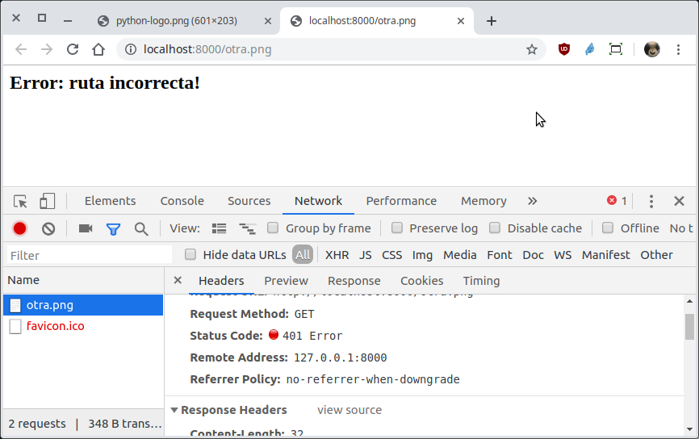

`Fullstack con Python` > [`Backend con Python`](../../Readme.md) > [`Sesión 02`](../Readme.md) > Reto-03

## Conociendo la interface WSGI creando una micro aplicación web con Python.

### OBJETIVO
Aplicar el flujo de información entre un servidor web y una aplicación en Python por medio de la interface WSGI (Web Server Gateway Interface).

#### REQUISITOS
1. Actualizar repositorio

#### DESARROLLO
1. Entendiendo la interface WSGI: Corregir el script `webapp/imagen.py` para que una vez ejecutada pueda responder a las siguientes peticiones desde el navegador:

   __Ejecución actual:__

   ```console
   webapp $ python imagen.py
   File "imagen.py", line 19
     nomimg = ???
             ^
   SyntaxError: invalid syntax
   ```

   __Peticiones a responder:__

   - http://localhost:8000/python-logo.png

      

   - http://localhost:8000/xxx-chicas.png

      (imagen sólo para ellas)

   - http://localhost:8000/xxx-chicos.png

      (imagen sólo para ellos)
   - http://localhost:8000/otra.png

      

   - http://localhost:8000/imagen.py

      (No existe!)

   - http://localhost:8000/info.py

      (No es imagen, pero nuestro script sólo sabe de imágenes, así que no existe!)
   ***

#### TIPS
- Hacer uso del valor de `environ["PATH_INFO"]`
- Dejar vivos tantos pingüinos como sea posible!
