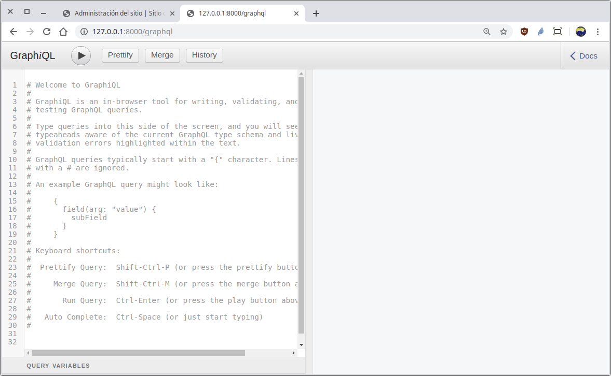
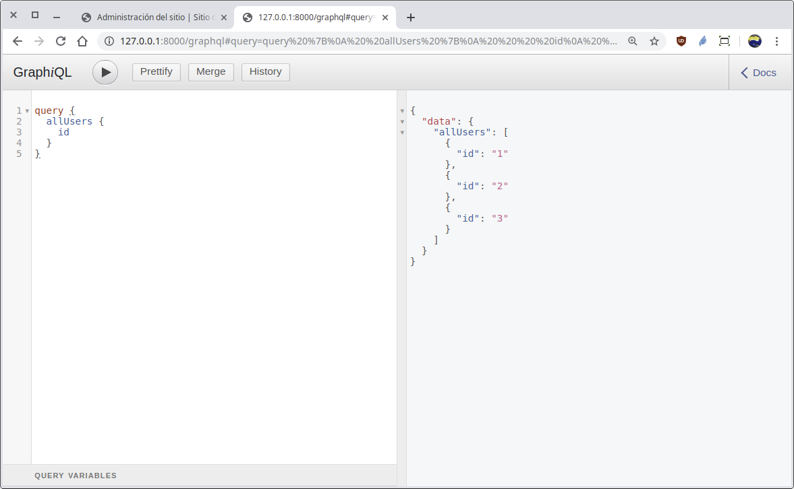
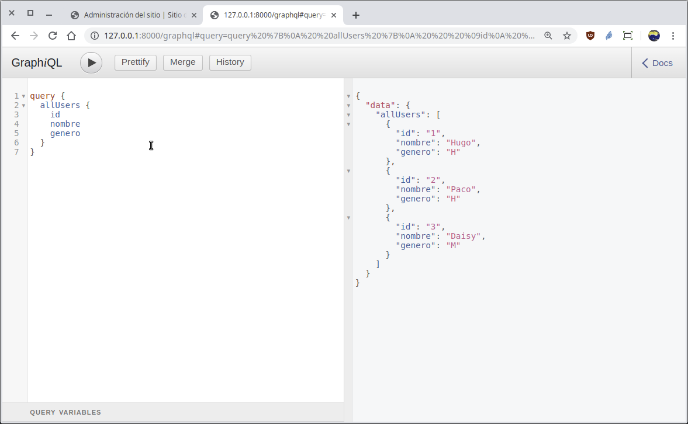
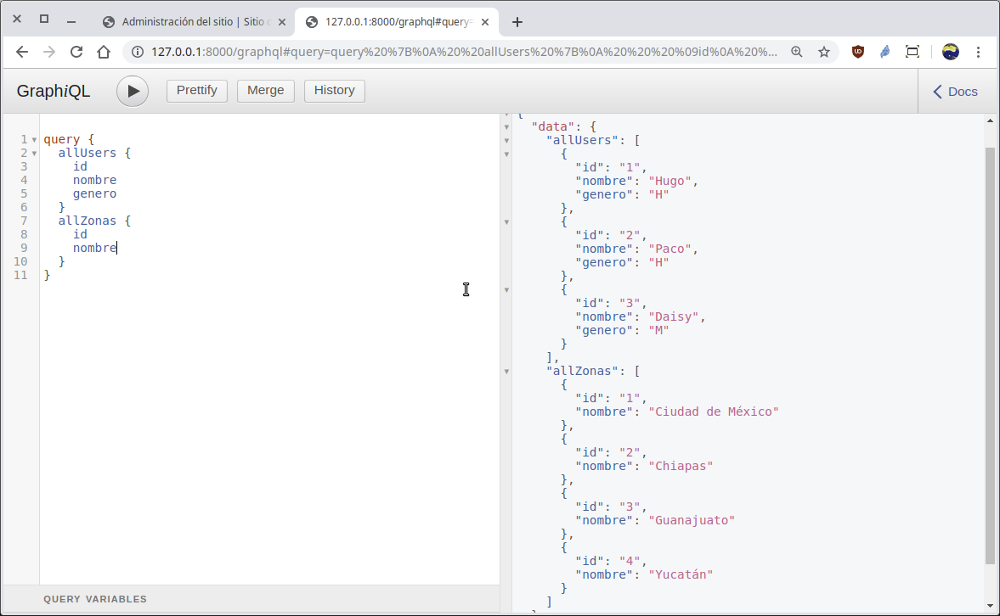

[`Backend con Python`](../../Readme.md) > [`Sesión 06`](../Readme.md) > Ejemplo-02
## Definiendo esquemas para crear un API GraphQL y realizar consultas de datos

### OBJETIVOS
- Configurar __Django Graphene__
- Definir la url única para el acceso a todo el __API GraphQL__
- Integrar __Django Graphene__ en el proyecto
- Definir el esquema para las consultas con __GraphQL__
- Realizar operaciones de consulta vía __API GraphQL__

### REQUISITOS
1. Actualizar repositorio
1. Usar la carpeta de trabajo `Sesion-06/Ejemplo-02`
1. Activar el entorno virtual __Bedutravels__
1. Diagrama de entidad-relación del proyecto Bedutravels
   
1. Carpeta de proyecto `Ejemplo-02/Bedutravels/` con los siguientes datos de acceso al admin de Django :
   - Usuario: bedutravels
   - Clave: bedutravels

### DESARROLLO
1. Agregando Django Graphene a la configuración en el archivo `settings.py` como una aplicación adicional:

   ```python
   INSTALLED_APPS = [
       'django.contrib.admin',
       'django.contrib.auth',
       'django.contrib.contenttypes',
       'django.contrib.sessions',
       'django.contrib.messages',
       'django.contrib.staticfiles',
       'tours',
       'graphene_django',
   ]
   ```
   ***

1. Se crea la ruta para la url `/graphql` modificando el archivo `Bedutravels/tours/urls.py`:

   ```python
   from django.urls import path
   from graphene_django.views import GraphQLView

   urlpatterns = [
       path('graphql', GraphQLView.as_view(graphiql=True)),
   ]
   ```
   ***

1. Se crea el esquema (schema) en el archivo `Bedutravels/tours/schema.py` para atender las consultas que obtiene la lista de todos los registros de los modelos __User__ y __Zona__

   ```python
   import graphene

   from graphene_django.types import DjangoObjectType
   from .models import User, Zona, Tour, Opinion, Salida
   ```
   Cada campo que será usando en la consulta, se define mediante un tipo de dato por medio de una clase que hereda de __DjangoObjectType__ y además es la encargada de crear el vínculo con el modelo correspondiente.

   A continuación se muestran la definición de los tipos __UserType__ y __ZonaType__.

   ```python
   class UserType(DjangoObjectType):
       """ Tipo de dato para manejar el tipo User """
       class Meta:
           # Se relaciona con el origen de la data en models.User
           model = User

   class ZonaType(DjangoObjectType):
       """ Tipo de dato para manejar el tipo Zona """
       class Meta:
           # Se relaciona con el origen de la data en models.Zona
           model = Zona
   ```
   Observar como en cada clase se vincula el modelo correspondiente.

   Después se crea la clase que atenderá las consultas realizadas desde el API:

   ```python
   class Query(graphene.ObjectType):
       """ Definición de las respuestas a las consultas posibles """

       # Se definen los posibles campos en las consultas
       all_users = graphene.List(UserType)  # allUsers
       all_zonas = graphene.List(ZonaType)  # allZonas

       # Se define las respuestas para cada campo definido
       def resolve_all_users(self, info, **kwargs):
           # Responde con la lista de todos registros
           return User.objects.all()

       def resolve_all_zonas(self, info, **kwargs):
           # Responde con la lista de todos registros
           return Zona.objects.all()
   ```

   Finalmente se crea la variable `schema` que define el esquema de los posibles campos y consultas.

   ```python
   # Se crea un esquema que hace uso de la clase Query
   schema = graphene.Schema(query=Query)   
   ```
   ***

1. Acceso y uso de la __API__ `/graphql`

   __Para tener acceso al API abrir la siguiente url:__

   http://localhost:8000/graphql

   Se deberá de observar algo similar a lo siguiente:

   

   __Obteniendo la lista de todos los registros del modelo User:__

   Escribir la siquiente consulta (query) en formato __GraphQL__ en la región izquierda remplazando cualquier contenido existente:

   ```json
   query {
     allUsers {
       id
     }
   }   
   ```
   luego dar click en el botón de reproducir (play), el resultado se mostrará en la región derecha similar al siguiente:

   
   Se puede observar como el resultado incluye los tres registros en el modelo __User__, pero sólo se ha obtenido el __id__, esto es porque en la consulta así se ha solicitado, entonces ahora se solicitará también el __nombre__ y el __genero__, se da click en reproducir (play) y se obtiene algo similar a:

   

   __Ahora también obteniendo la lista de todos los registros del modelo Zona con la siguiente consulta:__

   ```json
   query {
     allUsers {
       id
       nombre
       genero
     }
     allZonas {
       id
       nombre
     }
   }
   ```
   El resultado será similar a:

   
   ***
