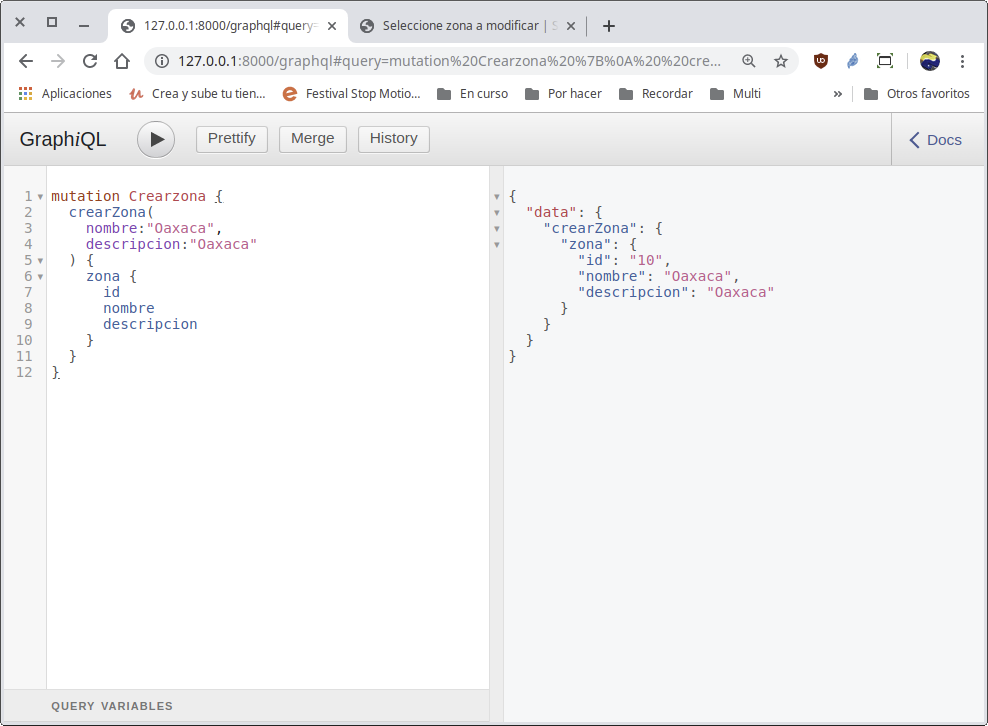
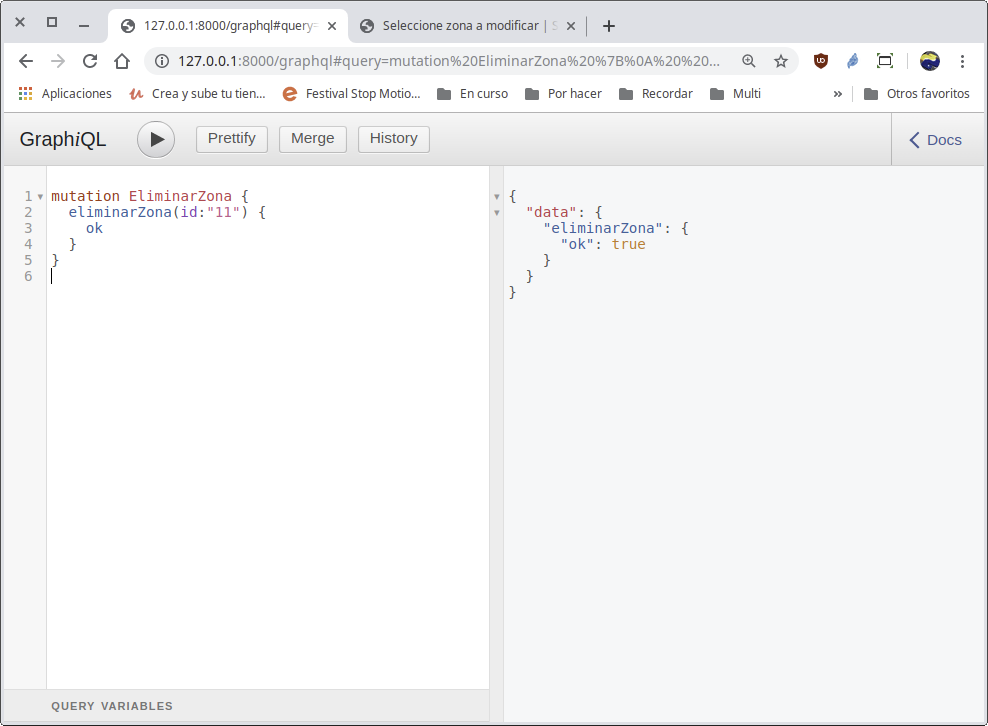

[`Backend con Python`](../../Readme.md) > [`Sesión 07`](../Readme.md) > Ejemplo-03
## Definiendo mutaciones (operaciones) para el API GraphQL

### OBJETIVOS
- Comprender y aplicar el concepto de mutaciones de GraphQL
- Crear una mutación para agregar una nueva Zona
- Crear una mutación para eliminar una Zona existente

### REQUISITOS
1. Actualizar repositorio
1. Usar la carpeta de trabajo `Sesion-07/Ejemplo-03`
1. Activar el entorno virtual __Bedutravels__
1. Diagrama de entidad-relación del proyecto Bedutravels
   

### DESARROLLO
1. Crear la mutación en el archivo `Bedutravels/tours/schema.py` que permite agregar un registro a la tabla __Zona__

   Se necesitan el tipo __ZoneType__ que ya está definido en el archivo, así que lo primero es crear la clase __CrearZona__ de la siguiente manera:

   ```python
   class CrearZona(graphene.Mutation):
       """ Permite realizar la operación de crear en la tabla Zona """

       class Arguments:
           """ Define los argumentos para crear una Zona """
           nombre = graphene.String(required=True)
           descripcion = graphene.String()
           latitud = graphene.Decimal()
           longitud = graphene.Decimal()

       # El atributo usado para la respuesta de la mutación
       zona = graphene.Field(ZonaType)

       def mutate(self, info, nombre, descripcion=None, latitud=None,
           longitud=None):
           """
           Se encarga de crear la nueva Zona donde sólo nombre es obligatorio, el
           resto de los atributos son opcionales.
           """
           zona = Zona(
               nombre=nombre,
               descripcion=descripcion,
               latitud=latitud,
               longitud=longitud
           )
           zona.save()

           # Se regresa una instancia de esta mutación y como parámetro la Zona
           # creada.
           return CrearZona(zona=zona)
   ```
   Por cada operación como Crear, Modificar o Eliminar es necesario crear una clase que hereda de __graphene.Mutation__ en este caso __CrearZona__ que se encargue de realizar la operación correspondiente.

   También es necesario crear la subclase __Arguments__ que define los argumentos y tipos que necesita la mutación, así como si son opcionales u obligatorios.

   Al igual que en las consultas, se definen los campos que se regresa como resultado de la ejecución de la mutación, en este caso la variable __zona__ que regresará la Zona creada.

   Finalmente, el método __mutate__ que es donde se realiza la operación de crear una nueva Zona con los datos recibidos.   
   ***

1. Agregar la mutación al esquema (schema) en el archivo `Bedutravels/tours/schema.py` para dar acceso a cada una de las mutaciones

   Para ello se crea una clase que contendrá todas las mutaciones posibles, done cada mutación es un argumento. La clase es la siguiente:

   ```python
   class Mutaciones(graphene.ObjectType):
       crear_zona = CrearZona.Field()
   ```

   Ahora agregamos esta lista de mutaciones (operaciones) al esquema:

   ```python
   schema = graphene.Schema(query=Query, mutation=Mutaciones)
   ```

1. Agregando una nueva Zona usando la __API__ `/graphql`

   __Abrir la url:__

   http://localhost:8000/graphql

   __Creando la zona Oaxaca:__

   ```json
   mutation Crearzona {
     crearZona(
       nombre:"Oaxaca",
       descripcion:"Oaxaca"
     ) {
       zona {
         id
         nombre
         descripcion
       }
     }
   }
   ```
   el resultado deberá ser similar al siguiente:

   

   __Creando la zona Michoacán:__

   ```json
   mutation Crearzona {
     mutation Crearzona {
       crearZona(
         nombre:"Michoacán",
         descripcion:"Oaxaca"
       ) {
         zona {
           id
           nombre
           descripcion
         }
       }
     }
   ```
   Ha! Hemos creado una zona erronea, hay que eliminarla y volver a crearla, por lo que a continuación se creará la mutación __EliminarZona__

1. Crear la mutación __EliminarZona__ en el archivo `Bedutravels/tours/schema.py` que permite eliminar un registro a la tabla __Zona__

   Se crea la clase __EliminarZona__ de la siguiente manera:

   ```python
   class EliminarZona(graphene.Mutation):
       """ Permite realizar la operación de eliminar en la tabla Zona """
       class Arguments:
           """ Define los argumentos para eliminar una Zona """
           id = graphene.ID(required=True)

       # El atributo usado para la respuesta de la mutación, en este caso sólo se
       # indicará con la variuable ok true en caso de éxito o false en caso
       # contrario
       ok = graphene.Boolean()

       def mutate(self, info, id):
           """
           Se encarga de eliminar la nueva Zona donde sólo es necesario el atributo
           id y además obligatorio.
           """
           try:
               # Si la zona existe se elimina sin más
               zona = Zona.objects.get(pk=id)
               zona.delete()
               ok = True
           except Zona.DoesNotExist:
               # Si la zona no existe, se procesa la excepción
               ok = False
           # Se regresa una instancia de esta mutación
           return EliminarZona(ok=ok)
   ```
   En este caso el único argumento necesario para borrar una Zona es el id, además de que el valor regresado por la mutación no es una Zona, si no, una variable de tipo lógico (Boolean) que regresa un valor de __true__ si se ha encontrado y eliminado la Zona o __false__ en caso contrario.
   ***

1. Agregar la nueva mutación al esquema (schema) en el archivo `Bedutravels/tours/schema.py`

   Por lo tanto hay que modificar la clase __Mutaciones__ de la siguiente manera:

   ```python
   class Mutaciones(graphene.ObjectType):
       crear_zona = CrearZona.Field()
       eliminar_zona = EliminarZona.Field()
   ```

   Como el esquema ya incluye la clase de mutaciones, ya no es necesario agregarla.
   ***

1. Eliminando una Zona usando la __API__ `/graphql`

   __Abrir la url:__

   http://localhost:8000/graphql

   __Elimando la zona Michoacán:__

   ```json
   mutation EliminarZona {
     eliminarZona(id:"11") {
       ok
     }
   }
   ```
   el resultado deberá ser similar al siguiente:

   
