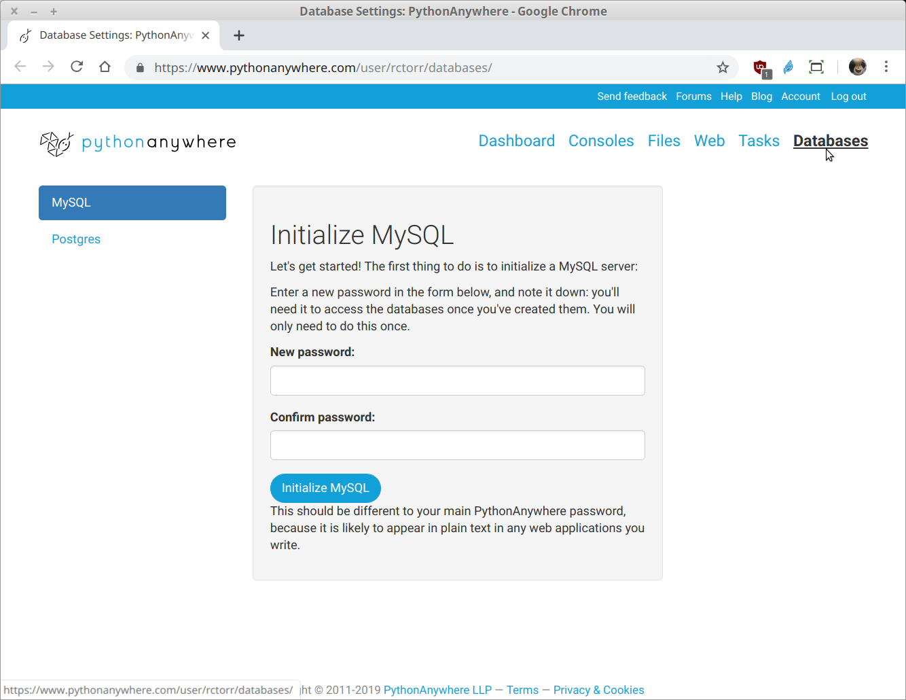
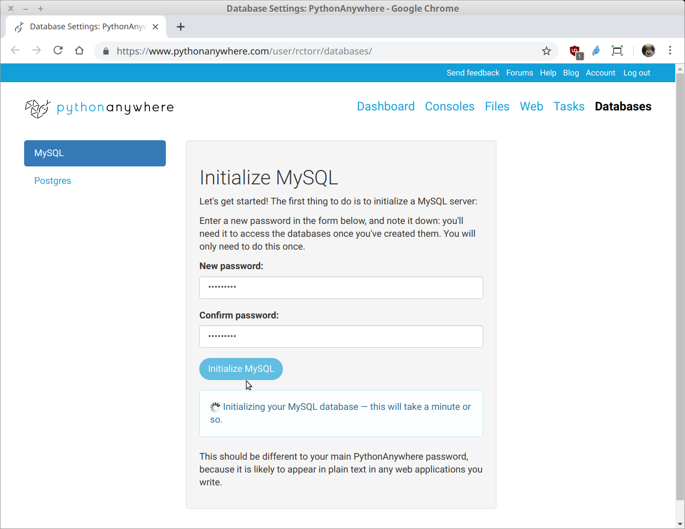
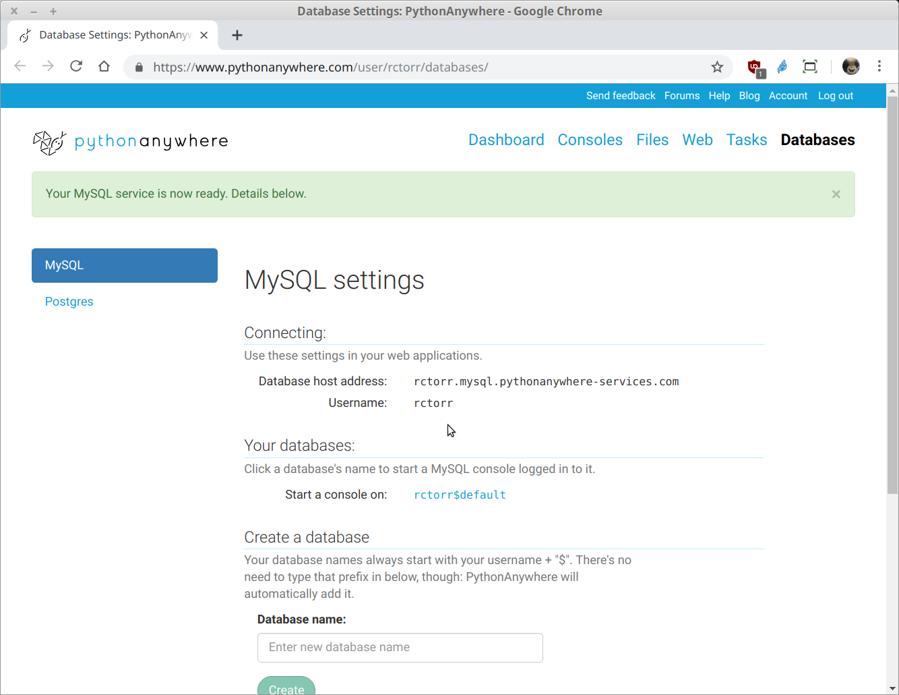
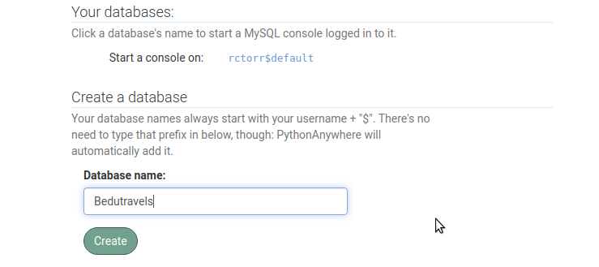
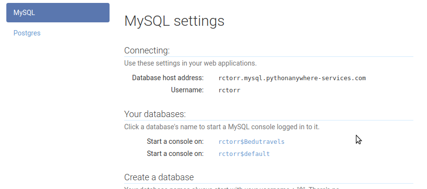

[`Backend con Python`](../../Readme.md) > [`Sesión 07`](../Readme.md) > Ejemplo-01
## Proveedores, requisitos, registro y bases de datos.

### OBJETIVOS
- Conocer algunos proveedores para hospedar nuestra aplicación web creada en Django.
- Elegir un proveedor, obtener los datos y requisitos para publicar nuestra aplicación.
- Generar un registro y base de datos.

### REQUISITOS
1. Actualizar repositorio
1. Usar la carpeta de trabajo `Sesion-07/Ejemplo-01`

### DESARROLLO
1. Algunos proveedores que pueden ser usados para hospedar nuestra aplicación creada con Python son:

   - PythonAnyWhere https://www.pythonanywhere.com *
   - Heroku https://www.heroku.com
   - Web Faction https://www.webfaction.com *
   - Digital Ocean https://www.digitalocean.com *
   - Google Cloud https://cloud.google.com
   - Amazon Web Services https://aws.amazon.com/es/
   - Infra estructura propia

1. El proveedor elegido será PythonAnyWhere, por lo que lo primero es registrarse para contar con usuario y clave.

   - https://www.pythonanywhere.com/registration/register/beginner/

   Se sugiere realizar la visita guiada de 7 pasos para conocer como funciona el sitio.

   __Nota:__ No olvides validar tu usuario dando click en la url del mensaje por email que te ha llegado desde PythonAnyWhere.

   Es posible que te aparezca un banner con un tutorial en fondo verde, el cual puedes cerrar y en caso de que quieras verlo nuevamente puedes ir a la url:

   - https://www.pythonanywhere.com/task_helpers/start/4-deploy-local-web-app/

   Aunque también se puede seguir la guía en:

   - https://help.pythonanywhere.com/pages/DeployExistingDjangoProject

1. Creando una base de datos para nuestro proyecto Bedutravels, lo primero es ir a la opción __Databases__ y asignar la clave para el usuario administrador del servidor MySQL y usaremos la misma clave usada en los contenedores __pythonsql__.

   

   
   Se está procesando la petición

   
   Aquí se obtienen los datos de coneción a la base de datos que en este caso serían:

   - User: tu-usuario
   - Pass: pythonsql
   - Host: tu-usuario.mysql.pythonanywhere-services.com
   ***

1. Estándo en la misma página del punto anterior, existe la opción para crear nuestra base de datos a la que llamaremos __Bedutravels__:

   

   
   Observa que ahora ya existen dos bases de datos __default__ y __Bedutravels__, sin embargo en PythonAnyWhere se agrega el prefijo con el usuario y el símbolo $, así que nuestros datos de conexión a la base de datos completos son:

   - User: tu-usuario
   - Pass: pythonsql
   - Host: tu-usuario.mysql.pythonanywhere-services.com
   - Base: tu-usuario$Bedutravels
