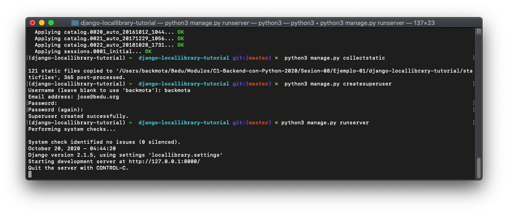
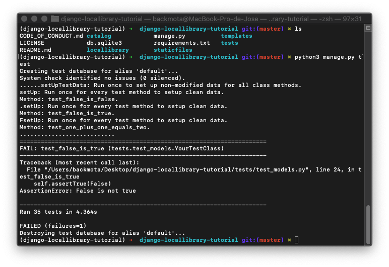

[`Backend con Python`](../../Readme.md) > [`Sesión 08`](../Readme.md) > Ejemplo-01
## Descripción general de la estructura de prueba

### OBJETIVOS
- Identificar dónde y cómo se definen las pruebas en django.

### REQUISITOS
1. Actualizar repositorio
1. Usar la carpeta de trabajo `Sesion-08/Ejemplo-01`

### DESARROLLO

1. Crear un entorno virtual para el proyecto **django-locallibrary-tutorial** con Django usando el siguiente comando:

`conda create --name django-locallibrary-tutorial python=3.7`


2. Activaremos el entorno virtual con el comando:

	`conda activate django-locallibrary-tutorial`

1. Entramos al directorio django-locallibrary-tutorial**

	`cd django-locallibrary-tutorial`

1. Instalaremos los requerimientos del archivo requirements.txt y procederemos a realizar las migraciones y crear el super usuario con los siguientes comandos:**

   ```
   pip3 install -r requirements.txt
   python3 manage.py makemigrations
   python3 manage.py migrate
   python3 manage.py collectstatic
   python3 manage.py createsuperuser
   python3 manage.py runserver
   ```


1. Django utiliza el descubrimiento de pruebas integrado del módulo unittest (built-in test discovery), que descubrirá pruebas en el directorio de trabajo actual en cualquier archivo nombrado con el patrón **test*.py**. Siempre que asigne un nombre a los archivos de forma adecuada, puede utilizar la estructura que desee. Recomendamos crear un módulo para su código de prueba y que tenga archivos separados para modelos, vistas, formularios y cualquier otro tipo de código que necesite probar. Por ejemplo:

	```console
	catalog/
  		/tests/
		    __init__.py
		    test_models.py
		    test_forms.py
		    test_views.py
	```

1. Cree una estructura de archivo como se muestra arriba en su proyecto  LocalLibrary. El  `__init__.py` debe ser un archivo vacío (esto le dice a Python que el directorio es un paquete). Puede crear los tres archivos de prueba copiando y cambiando el nombre del archivo de prueba de esqueleto /catalog/tests.py.

1. Abre el archivo /catalog/tests/test_models.py. El archivo debe importar django.test.TestCase, como se muestra:

	```python
		from django.test import TestCase

		# Create your tests here.
	```
	
1. Agregue la clase de prueba a continuación al final del archivo. La clase demuestra cómo construir una clase de caso de prueba derivando de TestCase.

	```python
		class YourTestClass(TestCase):

    @classmethod
    def setUpTestData(cls):
        print("setUpTestData: Run once to set up non-modified data for all class methods.")
        pass

    def setUp(self):
        print("setUp: Run once for every test method to setup clean data.")
        pass

    def test_false_is_false(self):
        print("Method: test_false_is_false.")
        self.assertFalse(False)

    def test_false_is_true(self):
        print("Method: test_false_is_true.")
        self.assertTrue(False)

    def test_one_plus_one_equals_two(self):
        print("Method: test_one_plus_one_equals_two.")
        self.assertEqual(1 + 1, 2)
    ```

1. La nueva clase define dos métodos que puede utilizar para la configuración previa a la prueba (por ejemplo, para crear modelos u otros objetos que necesitará para la prueba):

	* setUpTestData() se llama una vez al comienzo de la ejecución de prueba para la configuración a nivel de clase. Usaría esto para crear objetos que no se modificarán ni cambiarán en ninguno de los métodos de prueba.
	
	* setUp() se llama antes de cada función de prueba para configurar cualquier objeto que pueda ser modificado por la prueba (cada función de prueba obtendrá una versión "nueva" de estos objetos).

	* 	Debajo de ellos tenemos una serie de métodos de prueba, que utilizamos funciones Assert toprobar si las condiciones son verdaderas, falsas o iguales (AssertTrue, AssertFalse, AssertEqual). Si la condición no se evalúa como se esperaba, la prueba fallará y reportará el error a su consola.

	* Los AssertTrue, AssertFalse, AssertEqual son afirmaciones estándar proporcionadas por unittest.  Hay otras aserciones estándar en el marco y también aserciones específicas de Django (Django-specific assertions) para probar si una vista redirecciona (assertRedirects),para probar si se ha utilizado una plantilla en particular (assertTemplateUsed), etc.

1. La forma más sencilla de ejecutar todas las pruebas es utilizar el comando:

	```python
	python3 manage.py test
	```
	
	Esto descubrirá todos los archivos nombrados con el patrón `test*.py` bajo el directorio actual y ejecute todas las pruebas definidas usando las clases base apropiadas (aquí tenemos una serie de archivos de prueba, pero solo **/catalog/tests/test_models.py** contiene actualmente cualquier prueba). De forma predeterminada, las pruebas informarán individualmente solo sobre las fallas de las pruebas, seguidas de un resumen de la prueba.
	
	```console
	>python manage.py test

	Creating test database for alias 'default'...
	setUpTestData: Run once to set up non-modified data for all class methods.
	setUp: Run once for every test method to setup clean data.
	Method: test_false_is_false.
	.setUp: Run once for every test method to setup clean data.
	Method: test_false_is_true.
	FsetUp: Run once for every test method to setup clean data.
	Method: test_one_plus_one_equals_two.
	.
	======================================================================
	FAIL: test_false_is_true (catalog.tests.tests_models.YourTestClass)
	----------------------------------------------------------------------
	Traceback (most recent call last):
	  File "D:\Github\django_tmp\library_w_t_2\locallibrary\catalog\tests\tests_models.py", line 22, in test_false_is_true
	    self.assertTrue(False)
	AssertionError: False is not true
	
	----------------------------------------------------------------------
	Ran 3 tests in 0.075s
	
	FAILED (failures=1)
	Destroying test database for alias 'default'...
	```
	
