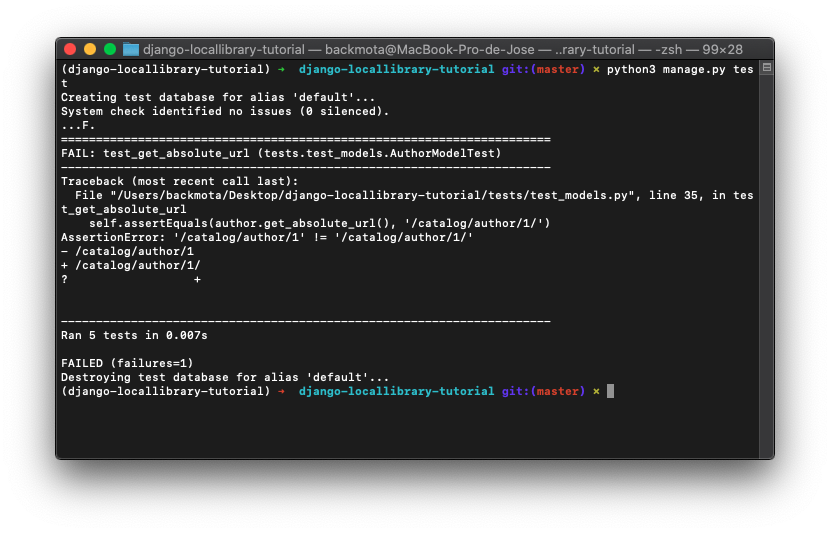

[`Backend con Python`](../../Readme.md) > [`Sesión 08`](../Readme.md) > Ejemplo-02
## Prueba de Módelos 

### OBJETIVOS
- Crear pruebas para Modelos

### REQUISITOS
1. Actualizar repositorio
1. Usar la carpeta de trabajo `Sesion-08/Ejemplo-02`

### DESARROLLO

1. Crear un entorno virtual para el proyecto **django-locallibrary-tutorial** con Django usando el siguiente comando:

`conda create --name django-locallibrary-tutorial python=3.7`


2. Activaremos el entorno virtual con el comando:

	`conda activate django-locallibrary-tutorial`

1. Entramos al directorio django-locallibrary-tutorial**

	`cd django-locallibrary-tutorial`

1. Instalaremos los requerimientos del archivo requirements.txt y procederemos a realizar las migraciones y crear el super usuario con los siguientes comandos:**

   ```
   pip3 install -r requirements.txt
   python3 manage.py makemigrations
   python3 manage.py migrate
   python3 manage.py collectstatic
   python3 manage.py createsuperuser
   python3 manage.py runserver
   ```


### Pruebas en el proyecto LocalLibrary

Ahora que sabemos cómo ejecutar nuestras pruebas y qué tipo de cosas necesitamos probar, veamos algunos ejemplos prácticos.

Como se discutió anteriormente, debemos probar todo lo que sea parte de nuestro diseño o que esté definido por el código que hayamos escrito, pero no las bibliotecas / código que ya haya probado Django o el equipo de desarrollo de Python.

Por ejemplo, considere el modelo de Author a continuación. Aquí deberíamos probar las etiquetas para todos los campos, porque aunque no hemos especificado explícitamente la mayoría de ellos, tenemos un diseño que dice cuáles deberían ser estos valores. Si no probamos los valores, entonces no sabemos que las etiquetas de los campos tienen sus valores deseados. De manera similar, aunque confiamos en que Django creará un campo de la longitud especificada, vale la pena especificar una prueba para esta longitud para asegurarse de que se implementó según lo planeado.

```python
class Author(models.Model):
    first_name = models.CharField(max_length=100)
    last_name = models.CharField(max_length=100)
    date_of_birth = models.DateField(null=True, blank=True)
    date_of_death = models.DateField('Died', null=True, blank=True)
    
    def get_absolute_url(self):
        return reverse('author-detail', args=[str(self.id)])
    
    def __str__(self):
        return '%s, %s' % (self.last_name, self.first_name)
```	

1. Abra **/catalog/tests/test_models.py** y reemplace cualquier código existente con el siguiente código de prueba para el Authormodelo.

1. Aquí verá que primero importamos `TestCase` y derivamos nuestra clase de prueba ( `AuthorModelTest`) de ella, usando un nombre descriptivo para que podamos identificar fácilmente cualquier prueba fallida en el resultado de la prueba. Luego llamamos setUpTestData()para crear un objeto de autor que usaremos pero no modificaremos en ninguna de las pruebas.

	```python
	from django.test import TestCase
	
	# Create your tests here.
	
	from catalog.models import Author
	
	class AuthorModelTest(TestCase):
	
	    @classmethod
	    def setUpTestData(cls):
	        #Set up non-modified objects used by all test methods
	        Author.objects.create(first_name='Big', last_name='Bob')
	
	    def test_first_name_label(self):
	        author=Author.objects.get(id=1)
	        field_label = author._meta.get_field('first_name').verbose_name
	        self.assertEquals(field_label,'first name')
	
	    def test_date_of_death_label(self):
	        author=Author.objects.get(id=1)
	        field_label = author._meta.get_field('date_of_death').verbose_name
	        self.assertEquals(field_label,'died')
	
	    def test_first_name_max_length(self):
	        author=Author.objects.get(id=1)
	        max_length = author._meta.get_field('first_name').max_length
	        self.assertEquals(max_length,100)
	
	    def test_object_name_is_last_name_comma_first_name(self):
	        author=Author.objects.get(id=1)
	        expected_object_name = '%s, %s' % (author.last_name, author.first_name)
	        self.assertEquals(expected_object_name,str(author))
	
	    def test_get_absolute_url(self):
	        author=Author.objects.get(id=1)
	        #This will also fail if the urlconf is not defined.
	        self.assertEquals(author.get_absolute_url(),'/catalog/author/1')
	```

1. Las pruebas de campo verifican que los valores de las etiquetas de campo ( verbose_name) y que el tamaño de los campos de caracteres sea el esperado. Todos estos métodos tienen nombres descriptivos y siguen el mismo patrón:

	```python
	author=Author.objects.get(id=1)   # Get an author object to test
	field_label = author._meta.get_field('first_name').verbose_name   # Get the metadata for the required field and use it to query the required field data
	self.assertEquals(field_label,'first name')  # Compare the value to the expected result
	```
1. Las cosas interesantes a tener en cuenta son:

	* No podemos obtener el verbose_nameuso directo author.first_name.verbose_name, porque author.first_namees una cadena (no un identificador del first_nameobjeto que podemos usar para acceder a sus propiedades). En su lugar, necesitamos usar el _metaatributo del autor para obtener una instancia del campo y usarlo para consultar la información adicional.
	
	* Elegimos usar en assertEquals(field_label,'first name')lugar de assertTrue(field_label == 'first name'). La razón de esto es que si la prueba falla, la salida de la primera le dice cuál era realmente la etiqueta, lo que facilita un poco la depuración del problema.

1. También necesitamos probar nuestros métodos personalizados. Básicamente, estos solo verifican que el nombre del objeto se construyó como esperábamos usando el formato "Apellido", "Nombre", y que la URL que obtenemos para un Authorelemento es la que esperamos.

```python
def test_object_name_is_last_name_comma_first_name(self):
    author=Author.objects.get(id=1)
    expected_object_name = '%s, %s' % (author.last_name, author.first_name)
    self.assertEquals(expected_object_name,str(author))
        
def test_get_absolute_url(self):
    author=Author.objects.get(id=1)
    #This will also fail if the urlconf is not defined.
    self.assertEquals(author.get_absolute_url(),'/catalog/author/1')
```

1. Ejecute las pruebas ahora. 




