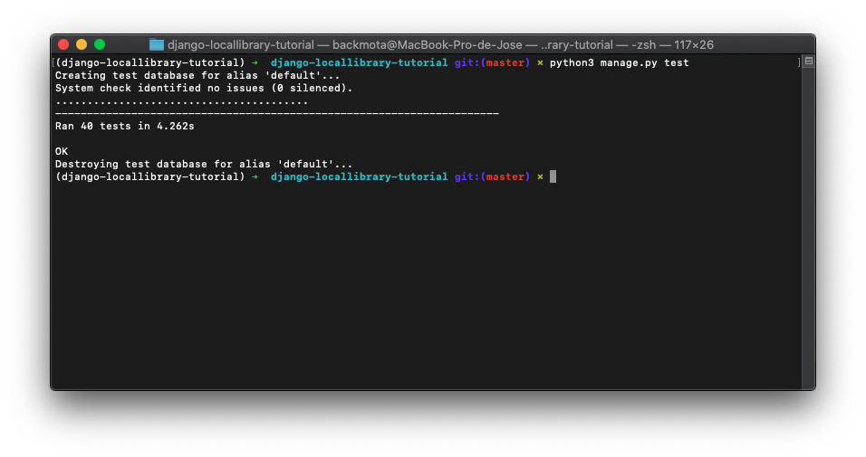

[`Backend con Python`](../../Readme.md) > [`Sesión 08`](../Readme.md) > Ejemplo-04
## Prueba de Formularios

### OBJETIVOS
- Crear pruebas para Formularios

### REQUISITOS
1. Actualizar repositorio
1. Usar la carpeta de trabajo `Sesion-08/Ejemplo-04`

### DESARROLLO

1. Crear un entorno virtual para el proyecto **django-locallibrary-tutorial** con Django usando el siguiente comando:

`conda create --name django-locallibrary-tutorial python=3.7`


2. Activaremos el entorno virtual con el comando:

	`conda activate django-locallibrary-tutorial`

1. Entramos al directorio django-locallibrary-tutorial**

	`cd django-locallibrary-tutorial`

1. Instalaremos los requerimientos del archivo requirements.txt y procederemos a realizar las migraciones y crear el super usuario con los siguientes comandos:**

   ```
   pip3 install -r requirements.txt
   python3 manage.py makemigrations
   python3 manage.py migrate
   python3 manage.py collectstatic
   python3 manage.py createsuperuser
   python3 manage.py runserver
   ```


### Pruebas en vistas

1. En algunos casos, querrá probar una vista que está restringida a usuarios que solo inician sesión. Por ejemplo, nuestra `LoanedBooksByUserListView` es muy similar a nuestra vista anterior, pero solo está disponible para los usuarios que han iniciado sesión y solo muestra los `BookInstance` registros que el usuario actual tomó prestados, que tienen el estado 'en préstamo' y están ordenados como "más antiguos primero".

	```python
	from django.contrib.auth.mixins import LoginRequiredMixin
	
	class LoanedBooksByUserListView(LoginRequiredMixin,generic.ListView):
	    """
	    Generic class-based view listing books on loan to current user.
	    """
	    model = BookInstance
	    template_name ='catalog/bookinstance_list_borrowed_user.html'
	    paginate_by = 10
	
	    def get_queryset(self):
	        return BookInstance.objects.filter(borrower=self.request.user).filter(status__exact='o').order_by('due_back')
	```

1. Agregue el siguiente código de prueba a **/catalog/tests/test_views.py** . Aquí primero usamos `SetUp()` para crear algunas cuentas y `BookInstance` objetos de inicio de sesión de usuario (junto con sus libros asociados y otros registros) que usaremos más adelante en las pruebas. Cada usuario de prueba toma prestados la mitad de los libros, pero inicialmente establecimos el estado de todos los libros en "mantenimiento". Hemos utilizado en `SetUp()` lugar de `setUpTestData()` porque modificaremos algunos de estos objetos más adelante.

	> Nota: El `setUp()` código a continuación crea un libro con una especificación **Language**, pero es posible que su código no incluya el Languagemodelo, ya que se creó como un desafío . Si este es el caso, simplemente comente las partes del código que crean o importan objetos de Lenguaje. También debe hacer esto en la  `RenewBookInstancesViewTestsección` que sigue.
	
	```python
	import datetime
	from django.utils import timezone
	        
	from catalog.models import BookInstance, Book, Genre, Language
	from django.contrib.auth.models import User #Required to assign User as a borrower
	
	class LoanedBookInstancesByUserListViewTest(TestCase):
	
	    def setUp(self):
	        #Create two users
	        test_user1 = User.objects.create_user(username='testuser1', password='12345') 
	        test_user1.save()
	        test_user2 = User.objects.create_user(username='testuser2', password='12345') 
	        test_user2.save()
	        
	        #Create a book
	        test_author = Author.objects.create(first_name='John', last_name='Smith')
	        test_genre = Genre.objects.create(name='Fantasy')
	        test_language = Language.objects.create(name='English')
	        test_book = Book.objects.create(title='Book Title', summary = 'My book summary', isbn='ABCDEFG', author=test_author, language=test_language)
	        # Create genre as a post-step
	        genre_objects_for_book = Genre.objects.all()
	        test_book.genre.set(genre_objects_for_book) #Direct assignment of many-to-many types not allowed.
	        test_book.save()
	
	        #Create 30 BookInstance objects
	        number_of_book_copies = 30
	        for book_copy in range(number_of_book_copies):
	            return_date= timezone.now() + datetime.timedelta(days=book_copy%5)
	            if book_copy % 2:
	                the_borrower=test_user1
	            else:
	                the_borrower=test_user2
	            status='m'
	            BookInstance.objects.create(book=test_book,imprint='Unlikely Imprint, 2016', due_back=return_date, borrower=the_borrower, status=status)
	        
	    def test_redirect_if_not_logged_in(self):
	        resp = self.client.get(reverse('my-borrowed'))
	        self.assertRedirects(resp, '/accounts/login/?next=/catalog/mybooks/')
	
	    def test_logged_in_uses_correct_template(self):
	        login = self.client.login(username='testuser1', password='12345')
	        resp = self.client.get(reverse('my-borrowed'))
	        
	        #Check our user is logged in
	        self.assertEqual(str(resp.context['user']), 'testuser1')
	        #Check that we got a response "success"
	        self.assertEqual(resp.status_code, 200)
	
	        #Check we used correct template
	        self.assertTemplateUsed(resp, 'catalog/bookinstance_list_borrowed_user.html')
	```

1. Para verificar que la vista redirigirá a una página de inicio de sesión si el usuario no ha iniciado sesión usamos assertRedirects, como se demuestra en test_redirect_if_not_logged_in(). Para verificar que la página se muestra para un usuario que inició sesión, primero iniciamos sesión en nuestro usuario de prueba, y luego accedemos a la página nuevamente y verificamos que obtenemos un status_code200 (éxito). 

1. El resto de la prueba verifica que nuestra vista solo devuelve libros que están prestados a nuestro prestatario actual. Copie el código (que se explica por sí mismo) al final de la clase de prueba anterior.

	```python
	def test_only_borrowed_books_in_list(self):
	        login = self.client.login(username='testuser1', password='12345')
	        resp = self.client.get(reverse('my-borrowed'))
	        
	        #Check our user is logged in
	        self.assertEqual(str(resp.context['user']), 'testuser1')
	        #Check that we got a response "success"
	        self.assertEqual(resp.status_code, 200)
	        
	        #Check that initially we don't have any books in list (none on loan)
	        self.assertTrue('bookinstance_list' in resp.context)
	        self.assertEqual( len(resp.context['bookinstance_list']),0)
	        
	        #Now change all books to be on loan 
	        get_ten_books = BookInstance.objects.all()[:10]
	
	        for copy in get_ten_books:
	            copy.status='o'
	            copy.save()
	        
	        #Check that now we have borrowed books in the list
	        resp = self.client.get(reverse('my-borrowed'))
	        #Check our user is logged in
	        self.assertEqual(str(resp.context['user']), 'testuser1')
	        #Check that we got a response "success"
	        self.assertEqual(resp.status_code, 200)
	        
	        self.assertTrue('bookinstance_list' in resp.context)
	        
	        #Confirm all books belong to testuser1 and are on loan
	        for bookitem in resp.context['bookinstance_list']:
	            self.assertEqual(resp.context['user'], bookitem.borrower)
	            self.assertEqual('o', bookitem.status)
	
	    def test_pages_ordered_by_due_date(self):
	    
	        #Change all books to be on loan
	        for copy in BookInstance.objects.all():
	            copy.status='o'
	            copy.save()
	            
	        login = self.client.login(username='testuser1', password='12345')
	        resp = self.client.get(reverse('my-borrowed'))
	        
	        #Check our user is logged in
	        self.assertEqual(str(resp.context['user']), 'testuser1')
	        #Check that we got a response "success"
	        self.assertEqual(resp.status_code, 200)
	                
	        #Confirm that of the items, only 10 are displayed due to pagination.
	        self.assertEqual( len(resp.context['bookinstance_list']),10)
	        
	        last_date=0
	        for copy in resp.context['bookinstance_list']:
	            if last_date==0:
	                last_date=copy.due_back
	            else:
	                self.assertTrue(last_date <= copy.due_back)
	```
	
### Prueba de vistas con formularios

1. Probar vistas con formularios es un poco más complicado que en los casos anteriores, porque necesita probar más rutas de código: visualización inicial, visualización después de que la validación de datos haya fallado y visualización después de que la validación haya tenido éxito. La buena noticia es que usamos el cliente para realizar pruebas casi exactamente de la misma manera que lo hicimos para las vistas de solo visualización.

1. Para demostrarlo, escribamos algunas pruebas para la vista utilizada para renovar libros (`renew_book_librarian()`):

	```python
	from .forms import RenewBookForm
	
	@permission_required('catalog.can_mark_returned')
	def renew_book_librarian(request, pk):
	    """
	    View function for renewing a specific BookInstance by librarian
	    """
	    book_inst=get_object_or_404(BookInstance, pk = pk)
	
	    # If this is a POST request then process the Form data
	    if request.method == 'POST':
	
	        # Create a form instance and populate it with data from the request (binding):
	        form = RenewBookForm(request.POST)
	
	        # Check if the form is valid:
	        if form.is_valid():
	            # process the data in form.cleaned_data as required (here we just write it to the model due_back field)
	            book_inst.due_back = form.cleaned_data['renewal_date']
	            book_inst.save()
	
	            # redirect to a new URL:
	            return HttpResponseRedirect(reverse('all-borrowed') )
	
	    # If this is a GET (or any other method) create the default form
	    else:
	        proposed_renewal_date = datetime.date.today() + datetime.timedelta(weeks=3)
	        form = RenewBookForm(initial={'renewal_date': proposed_renewal_date,})
	
	    return render(request, 'catalog/book_renew_librarian.html', {'form': form, 'bookinst':book_inst})
	```
1. Necesitaremos probar que la vista solo está disponible para los usuarios que tienen el `can_mark_returned` permiso, y que los usuarios son redirigidos a una página de error HTTP 404 si intentan renovar una `BookInstance` que no existe. Debemos verificar que el valor inicial del formulario esté sembrado con una fecha de tres semanas en el futuro, y que si la validación se realiza correctamente, se nos redirige a la vista "Todos los libros prestados". Como parte de la verificación de las pruebas de validación fallida, también verificaremos que nuestro formulario envíe los mensajes de error apropiados.

1. Agregue la primera parte de la clase de prueba (que se muestra a continuación) al final de **/catalog/tests/test_views.py** . Esto crea dos usuarios y dos instancias de libros, pero solo le otorga a un usuario el permiso necesario para acceder a la vista. El código para otorgar permisos durante las pruebas se muestra en negrita:

	```
	from django.contrib.auth.models import Permission # Required to grant the permission needed to set a book as returned.
	
	class RenewBookInstancesViewTest(TestCase):
	
	    def setUp(self):
	        #Create a user
	        test_user1 = User.objects.create_user(username='testuser1', password='12345')
	        test_user1.save()
	
	        test_user2 = User.objects.create_user(username='testuser2', password='12345')
	        test_user2.save()
	        permission = Permission.objects.get(name='Set book as returned')
	        test_user2.user_permissions.add(permission)
	        test_user2.save()
	
	        #Create a book
	        test_author = Author.objects.create(first_name='John', last_name='Smith')
	        test_genre = Genre.objects.create(name='Fantasy')
	        test_language = Language.objects.create(name='English')
	        test_book = Book.objects.create(title='Book Title', summary = 'My book summary', isbn='ABCDEFG', author=test_author, language=test_language,)
	        # Create genre as a post-step
	        genre_objects_for_book = Genre.objects.all()
	        test_book.genre.set(genre_objects_for_book) # Direct assignment of many-to-many types not allowed.
	        test_book.save()
	
	        #Create a BookInstance object for test_user1
	        return_date= datetime.date.today() + datetime.timedelta(days=5)
	        self.test_bookinstance1=BookInstance.objects.create(book=test_book,imprint='Unlikely Imprint, 2016', due_back=return_date, borrower=test_user1, status='o')
	
	        #Create a BookInstance object for test_user2
	        return_date= datetime.date.today() + datetime.timedelta(days=5)
	        self.test_bookinstance2=BookInstance.objects.create(book=test_book,imprint='Unlikely Imprint, 2016', due_back=return_date, borrower=test_user2, status='o')
	```
	
1. Agregue las siguientes pruebas al final de la clase de prueba. Éstos comprueban que solo los usuarios con los permisos correctos ( testuser2 ) puedan acceder a la vista. Comprobamos todos los casos: cuando el usuario no está conectado, cuando un usuario está conectado pero no tiene los permisos correctos, cuando el usuario tiene permisos pero no es el prestatario (debería tener éxito), y qué sucede cuando intenta acceder a un `BookInstance` que no existe. También comprobamos que se utilice la plantilla correcta.

	```python
	def test_redirect_if_not_logged_in(self):
	        resp = self.client.get(reverse('renew-book-librarian', kwargs={'pk':self.test_bookinstance1.pk,}) )
	        #Manually check redirect (Can't use assertRedirect, because the redirect URL is unpredictable)
	        self.assertEqual( resp.status_code,302)
	        self.assertTrue( resp.url.startswith('/accounts/login/') )
	        
	    def test_redirect_if_logged_in_but_not_correct_permission(self):
	        login = self.client.login(username='testuser1', password='12345')
	        resp = self.client.get(reverse('renew-book-librarian', kwargs={'pk':self.test_bookinstance1.pk,}) )
	        
	        #Manually check redirect (Can't use assertRedirect, because the redirect URL is unpredictable)
	        self.assertEqual( resp.status_code,302)
	        self.assertTrue( resp.url.startswith('/accounts/login/') )
	
	    def test_logged_in_with_permission_borrowed_book(self):
	        login = self.client.login(username='testuser2', password='12345')
	        resp = self.client.get(reverse('renew-book-librarian', kwargs={'pk':self.test_bookinstance2.pk,}) )
	        
	        #Check that it lets us login - this is our book and we have the right permissions.
	        self.assertEqual( resp.status_code,200)
	
	    def test_logged_in_with_permission_another_users_borrowed_book(self):
	        login = self.client.login(username='testuser2', password='12345')
	        resp = self.client.get(reverse('renew-book-librarian', kwargs={'pk':self.test_bookinstance1.pk,}) )
	        
	        #Check that it lets us login. We're a librarian, so we can view any users book
	        self.assertEqual( resp.status_code,200)
	
	    def test_HTTP404_for_invalid_book_if_logged_in(self):
	        import uuid 
	        test_uid = uuid.uuid4() #unlikely UID to match our bookinstance!
	        login = self.client.login(username='testuser2', password='12345')
	        resp = self.client.get(reverse('renew-book-librarian', kwargs={'pk':test_uid,}) )
	        self.assertEqual( resp.status_code,404)
	        
	    def test_uses_correct_template(self):
	        login = self.client.login(username='testuser2', password='12345')
	        resp = self.client.get(reverse('renew-book-librarian', kwargs={'pk':self.test_bookinstance1.pk,}) )
	        self.assertEqual( resp.status_code,200)
	
	        #Check we used correct template
	        self.assertTemplateUsed(resp, 'catalog/book_renew_librarian.html')
	```
1. Agregue el siguiente método de prueba, como se muestra a continuación. Esto verifica que la fecha inicial del formulario sea de tres semanas en el futuro. Observe cómo podemos acceder al valor del valor inicial del campo del formulario (que se muestra en negrita).

	```python
	def test_form_renewal_date_initially_has_date_three_weeks_in_future(self):
	        login = self.client.login(username='testuser2', password='12345')
	        resp = self.client.get(reverse('renew-book-librarian', kwargs={'pk':self.test_bookinstance1.pk,}) )
	        self.assertEqual( resp.status_code,200)
	        
	        date_3_weeks_in_future = datetime.date.today() + datetime.timedelta(weeks=3)
	        self.assertEqual(resp.context['form'].initial['renewal_date'], date_3_weeks_in_future )
	```

1. La siguiente prueba (agregue esto a la clase también) verifica que la vista redirija a una lista de todos los libros prestados si la renovación tiene éxito. Lo que se diferencia aquí es que por primera vez mostramos cómo se pueden `POST` datos utilizando el cliente. Los datos de publicación son el segundo argumento de la función de publicación y se especifican como un diccionario de clave / valores.

	```python
	def test_redirects_to_all_borrowed_book_list_on_success(self):
	        login = self.client.login(username='testuser2', password='12345')
	        valid_date_in_future = datetime.date.today() + datetime.timedelta(weeks=2)
	        resp = self.client.post(reverse('renew-book-librarian', kwargs={'pk':self.test_bookinstance1.pk,}), {'renewal_date':valid_date_in_future} )
	        self.assertRedirects(resp, reverse('all-borrowed') )
	```
1. Copie las dos últimas funciones en la clase, como se ve a continuación. Estos vuelven a probar las POSTsolicitudes, pero en este caso con fechas de renovación no válidas. Usamos assertFormError() para verificar que los mensajes de error sean los esperados.

	```	
	 def test_form_invalid_renewal_date_past(self):
	        login = self.client.login(username='testuser2', password='12345')       
	        date_in_past = datetime.date.today() - datetime.timedelta(weeks=1)
	        resp = self.client.post(reverse('renew-book-librarian', kwargs={'pk':self.test_bookinstance1.pk,}), {'renewal_date':date_in_past} )
	        self.assertEqual( resp.status_code,200)
	        self.assertFormError(resp, 'form', 'renewal_date', 'Invalid date - renewal in past')
	        
	    def test_form_invalid_renewal_date_future(self):
	        login = self.client.login(username='testuser2', password='12345')
	        invalid_date_in_future = datetime.date.today() + datetime.timedelta(weeks=5)
	        resp = self.client.post(reverse('renew-book-librarian', kwargs={'pk':self.test_bookinstance1.pk,}), {'renewal_date':invalid_date_in_future} )
	        self.assertEqual( resp.status_code,200)
	        self.assertFormError(resp, 'form', 'renewal_date', 'Invalid date - renewal more than 4 weeks ahead')
	```
1. Ejecute las pruebas ahora.
 
```console
python3 manage.py test
```

