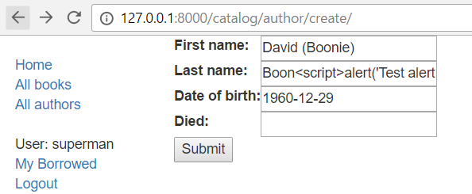
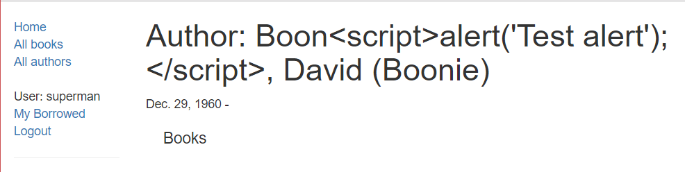

[`Backend con Python`](../../Readme.md) > [`Sesión 08`](../Readme.md) > Ejemplo-05
## Secuencias de comandos entre sitios (XSS)

### OBJETIVOS
- Indentificar el mecanismo de protección contra comandos XSS

### REQUISITOS
1. Actualizar repositorio
1. Usar la carpeta de trabajo `Sesion-08/Ejemplo-05`

### DESARROLLO

1. Crear un entorno virtual para el proyecto **django-locallibrary-tutorial** con Django usando el siguiente comando:

`conda create --name django-locallibrary-tutorial python=3.7`


2. Activaremos el entorno virtual con el comando:

	`conda activate django-locallibrary-tutorial`

1. Entramos al directorio django-locallibrary-tutorial**

	`cd django-locallibrary-tutorial`

1. Instalaremos los requerimientos del archivo requirements.txt y procederemos a realizar las migraciones y crear el super usuario con los siguientes comandos:**

   ```
   pip3 install -r requirements.txt
   python3 manage.py makemigrations
   python3 manage.py migrate
   python3 manage.py collectstatic
   python3 manage.py createsuperuser
   python3 manage.py runserver
   ```


1. Abra el sitio en su navegador local e inicie sesión en su cuenta de superusuario.

1. Navegue a la página de creación del autor (que debería estar en URL :) [http://127.0.0.1:8000/catalog/author/create/]().

1. Introducir nombres y detalles de fecha para un nuevo usuario, y luego agregar el siguiente texto en el campo Apellido:
`<script>alert('Test alert');</script>`.

	

	> Nota: Este es un script inofensivo que, si se ejecuta, mostrará un cuadro de alerta en su navegador. Si se muestra la alerta cuando envía el registro, el sitio es vulnerable a las amenazas XSS.

1. Presione Enviar para guardar el registro.

1. Cuando guarde el autor, se mostrará como se muestra a continuación. Debido a las protecciones XSS `alert()`, no se debe ejecutar. En su lugar, la secuencia de comandos se muestra como texto sin formato.

	
	
1. Si ve el código fuente HTML de la página, puede ver que los caracteres peligrosos para las etiquetas de secuencia de comandos se han convertido en sus equivalentes de código de escape inofensivos (por ejemplo, `>` ahora `&gt;`)

	```html
	<h1>Author: Boon&lt;script&gt;alert(&#39;Test alert&#39;);&lt;/script&gt;, David (Boonie) </h1>
	```

1. El uso de plantillas de Django lo protege contra la mayoría de los ataques XSS. Sin embargo, es posible desactivar esta protección, y la protección no se aplica automáticamente a todas las etiquetas que normalmente no se llenarían con la entrada del usuario (por ejemplo, el `help_text` campo en un formulario generalmente no lo proporciona el usuario, por lo que Django no lo hace no escapar de esos valores).

1. También es posible que los ataques XSS se originen en otra fuente de datos que no sea de confianza, como cookies, servicios web o archivos cargados (siempre que los datos no estén lo suficientemente desinfectados antes de incluirlos en una página). Si está mostrando datos de estas fuentes, es posible que deba agregar su propio código de desinfección.