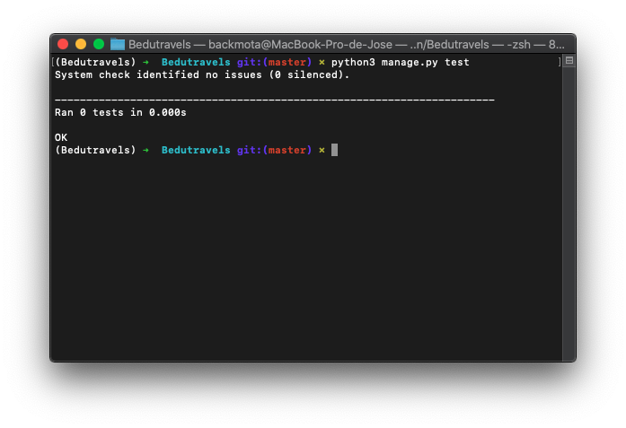

[`Backend con Python`](../../Readme.md) > [`Sesión 08`](../Readme.md) > Reto-01
## Prueba de Módelos 

### OBJETIVOS
- Crear pruebas para Modelos

### REQUISITOS
1. Actualizar repositorio
1. Usar la carpeta de trabajo `Sesion-08/Reto-01`
1. Activar el entorno virtual

### DESARROLLO

1. Crear pruebas para los Módelos de **Bedutravels**

